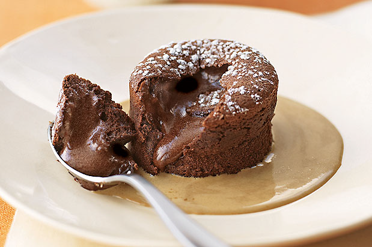

# Warm chocolate fondant

**Serves:** 10

## Ingredients
- 200 grams butter  softened
- 20 grams butter  to grease
- 200 grams dark chocolate  finely chopped
- 200 grams icing sugar  sifted
- 4 eggs
- 4 egg yolks
- 55 grams flour
- 35 grams cocoa powder

## Method
1. Use a brush to lightly butter the insides of 12 metal rings, 5 cm in diameter and 3.5 cm high and line each with a band of greaseproof paper, 5 cm high. 
1. Stand the rings on a baking tray lined with greaseproof paper.
1. Preheat the oven to 190°C.
1. Put the chocolate into a heatproof bowl and set over a saucepan one-third filled with hot water, making sure the bottom of the bowl is not in contact with the water. 
1. Place over a gentle heat until the chocolate has melted. 
1. Take off the heat and set aside in a warm place.
1. Using an electric whisk, beat the butter and icing sugar together until pale and aerated, then slowly incorporate the eggs, whisking constantly to keep the mixture smooth. 
1. Reduce the mixer speed and incorporate the melted chocolate a little at a time. 
1. Sift the flour and cocoa together over the mixture and fold in carefully, using a large metal spoon.
1. Fill the prepared moulds with the fondant mixture to the top of the rings.
1. Bake in the oven for 8-10 minutes.
1. To check to see if they are done, insert a small skewer into the centre of one; If the centre feels like liquid then it is not yet cooked. 
1. If if feels soft, and the skewer meets not resistance they are done. 
1. The centre should still be slightly runny. 
1. Remove from the oven and leave to rest on the baking tray for 30 seconds.
1. Lift the rings off all the fondants, slide a small palette knife under one, transfer it to a serving plate and remove the band of greaseproof paper. 
1. Repeat with the remaining fondants, and dust with icing sugar. 
1. Pour crème anglaise around each fondant and serve immediately.