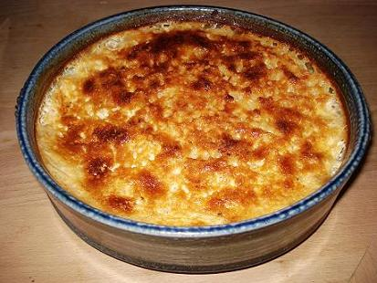

# Cardamom-scented rice puddings

*These individual rice puddings are soft, gooey in the middle and delicate. The can be served with mandarin contributing a refreshing hint of citrus.*

**Serves:** 8

## Ingredients
- 750 ml milk
- 75 grams short grain pudding rice
- 8 cardamom pods (crushed and tied in muslin)
- 6 egg yolks
- 75 grams caster sugar

### For the caramel
- 120 grams caster sugar
- 30 grams liquid glucose

## Method
1. Bring the milk to the boil in a pan, then tip in the rice.
1. Add the cardamom.
1. Cook over a gentle heat for 15 minutes, stirring from time to time.
1. Take off the heat, cover and set aside for 10 minutes.
1. Whisk the egg yolks and sugar together in a large bowl.
1. Discard the cardamom from the rice and milk, then stir into the whisked mixture.

### To make the caramel
1. Dissolve the sugar in 2 tablespoons of water in a small heavy-based pan and bring gently to the boil.
1. Use a brush dipped in cold water to brush down any crystals that form on the side of the pan.
1. Add the glucose and cook gently to a light caramel.
1. Divide between 8 ceramic moulds, 7 cm in diameter and 3.5 cm high, rotating each so that the caramel coats two-thirds of the way up the sides.
1. Stand in a shallow roasting dish lined with greaseproof paper.
1. Preheat the oven to 120°C.

### To make the puddings
1. Divide the rice mix between the moulds.
1. Pour enough hot water into the roasting dish to come halfway up the sides of the moulds.
1. Transfer carefully to the oven and cook for 50 minutes, until set.
1. Transfer the moulds to a wire rack to cool, then chill for 4 hours if serving cold, or serve straight away.
