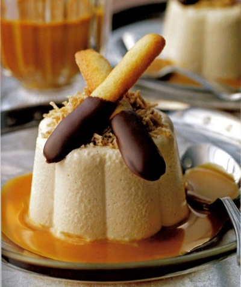

# Chestnut crème with caramel sauce

**Serves:** 4

## Ingredients
- half a sheet gelatine
- 180 grams tinned sweet chestnut purée
- 200 ml whipping cream (chilled)
- 100 ml Cognac or Armagnac
- 8 Chocolate-dipped langues de chat
- half quantity Sauce caramel
- 125 ml milk
- 6 fresh chestnuts

## Method
### For the cream
1. Soften the gelatine in a shallow dish of cold water for about 5 minutes. Whip the chestnut purée and cream together in a bowl to a ribbon consistency. Heat the Cognac in a small pan, then remove from the heat. Drain the gelatine and squeeze out excess water, then add to the Cognac, stirring to dissolve. Transfer to a bowl and, using a whisk, work in a quarter of the chestnut and cream mixture until it is evenly combined, then fold in the rest.
1. Divide the mixture between 4 moulds, about 7 cm in diameter and 6 cm tall (ideally decorative). Refrigerate for 4 hours.

### For the chestnuts
1. Split the skin of each chestnut on one side to a depth of 5 mm, using a small knife. Put into a small saucepan with the milk and 125 ml of water and cook over a medium heat for 20 - 25 minutes. 
1. Remove from the heat and peel off the skins and softer inner peel, using a small knife. Return the peeled chestnuts to the pan and leave to cool in the milky liquid.

### To turn out
1. Dip the base of each mould in very hot water for 15 seconds, then invert onto a serving plate. Drain the chestnuts thoroughly and press through a small chinois or sieve, to create 'chestnut vermicelli'.
1. Scatter on top of the creams. Lay 2 langues de chat on each dessert and pour the caramel sauce around to serve. 