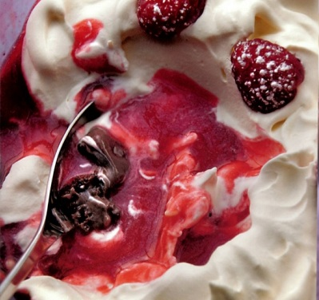

# Chocolate and raspberry trifle

*In this trifle the layers are soft, with a hint of sharpness. Ideally the chocolate sponge will be made a day in advance.*

**Serves:** 6

## Ingredients
- 60 grams good quality white chocolate (chopped into pieces)
- 150 grams chocolate Génoise nature
- 2 tablespoons sweet dessert wine
- 200 ml whipping cream
- 8 perfect raspberries
- icing sugar (to dust)

### Chocolate crème pâtissière
- 375 ml milk
- 50 grams caster sugar
- 4 egg yolks
- 20 grams plain flour
- 20 grams dark cocoa powder

### Raspberry sauce
- 125 grams raspberries
- 1 lemon juice
- 60 grams icing sugar

## Method
### For the crème pâtissière
1. Heat the milk and two-thirds of the sugar in a pan. 
1. Whisk the egg yolks and remaining sugar in a bowl, using a balloon whisk until it has reached ribbon consistency, then whisk in the flour. 
1. As the milk boils, whisk in the cocoa, then pour onto the egg yolks, whisking all the time. 
1. Return to the pan, bring to the boil and let bubble for 30 seconds, still whisking. Pour into a dish, sprinkle lightly with icing sugar to prevent a skin from forming and leave to cool, then cover with cling film and refrigerate (until chilled but not set).

### For the sauce
1. Put the raspberries, lemon juice and icing sugar into a food processor or blender and purée for 1 minute, strain through a conical fine-meshed sieve and refrigerate.
1. Melt the white chocolate in a bain-marie or heatproof bowl set over a pan of water. 
1. Cut the Génoise sponge into 1.5 cm cubes and place in the bottom of a large glass serving bowl, about 20 cm in diameter and 7 cm deep. 
1. Sprinkle the dessert wine evenly over, then cover with the crème pâtissière.
1. Pour the raspberry sauce on top, then trickle the melted white chocolate over the surface.
1. Whip the cream to a ribbon consistency, then spoon on top of the trifle, peaking it with the end of a palette knife. 
1. Refrigerate for 2 - 3 hours.
1. To serve, arrange the raspberries on top and dust with a little icing sugar.