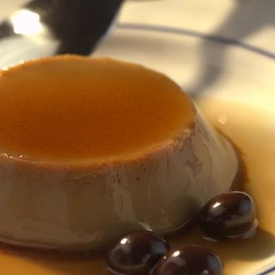

# Name

**Serves:** 8

## Ingredients
### Caramel
- 120 grams caster sugar
- 30 grams liquid glucose (optional)

### Crème
- 250 ml milk
- 20 grams coffee beans (finely ground)
- 100 ml whipping cream
- 3 eggs
- 3 egg yolks
- 60 grams caster sugar
- 10 grams coffee beans (crushed, to serve)

## Method
### For the caramel
1. Dissolve the sugar in 2 tablespoons of water in a small, heavy-based pan and bring gently to the boil. 
1. Use a brush dipped in cold water to brush down any crystals forming on the side of the pan. 
1. Add the glucose, if using. 
1. Cook gently to a light caramel. Divide between 8 ceramic or metal moulds, 7 cm in diameter and 3.5 cm high, rotating each, so the caramel coats two-thirds of the way up the sides. 
1. Stand in a shallow roasting dish lined with greaseproof paper. 
1. Preheat the oven to 120°C.

### For the crème
1. Bring the milk and ground coffee to the boil in a pan, then add the cream and return to the boil. 
1. Take off the heat and set aside to infuse. Gently whisk the eggs, egg yolks and sugar together in a bowl for 1 minute. 
1. Slowly strain the boiling hot coffee milk through a fine-meshed conical sieve onto th egg and sugar mix, stirring with a balloon whisk as you do so. Use a skimmer to remove any bubbles from the surface.
1. Fill the caramel-lined moulds with the mixture, to about 5 mm from the rip. 
1. Pour enough hot water into the roasting dish to come halfway up the sides of the moulds. 
1. Place carefully in the oven and cook for 50 minutes or until lightly set. 
1. Transfer the moulds to a wire rack to cool, then chill for 4 hours.
1. To turn out, dip the base of each mould in boiling water for 10 seconds, then invert over a shallow bowl. 
1. Spoon any caramel left in the moulds over each crème caramel. 
1. Sprinkle the crushed coffee beans around the base. 
1. Serve cold but not overly chilled.