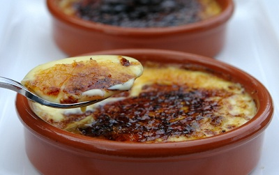

# Crema Catalana

**Serves:** 4

## Ingredients
- 750 ml milk (ideally goats)
- 1 heaped teaspoon fennel seeds (crushed)
- 1 small cinnamon stick (broken
- 150 grams caster sugar
- 1 orange zest (finely grated)
- 1 lemon zest (finely grated)
- 2 eggs
- 6 egg yolks
- 40 grams cornflour
- 80 grams demerara sugar

## Method
1. Put the milk, fennel seeds, cinnamon and 100 grams of the caster sugar in a saucepan and bring to the boil. 
1. As soon as it boils, add the citrus zests. Take off the heat, cover and leave to infuse for 5 - 10 minutes.
1. Put the eggs, egg yolks and remaining 50 grams of the caster sugar into a bowl and mix with a balloon whisk for 30 seconds.
1. Add the cornflour and mix well. 
1. Slowly strain the milk through a chinois or sieve into the egg mixture, stirring with a whisk as you do so, then return to the pan.
1. Cook the mixture over a gentle heat for 3 minutes, until thickened, stirring all the time with a whisk. 
1. Spoon into shallow individual dishes, about 14 cm in diameter and 3 cm deep, smoothing it lightly and evenly with the back of a spoon. 
1. Leave to cool, then chill in the fridge for at least 2 hours.
1. Sprinkle half the demerara sugar evenly over the cremas, then wave a cooks blowtorch over the surface to caramelise lightly, or place briefly under a hot grill. 
1. Wait 5 minutes, then repeat to create a generous caramel layer. 
1. Serve at once, to fully appreciate the contrast of the warm, crisp caramel and the cold crema underneath.