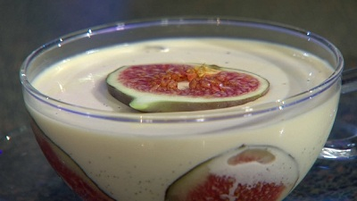

# Fig and honey pannacotta

*Honey adds a lovely dimension, but if you are concerned about upsetting the purity of the flavour, use sugar instead.*
**Serves:** 6

## Ingredients
- 1 ½ sheets leaf gelatine
- 300 ml double cream
- 200 ml  milk
- 100 grams runny honey (or 80 grams caster sugar)
- 2 vanilla pods (split length-ways)
- 3 ripe fresh figs (sliced into rounds

## Method
1. Put the gelatine in a bowl, and cover with water. Leave for 5 minutes. Heat the cream, milk, honey (or sugar) and vanilla pods in a saucepan, stirring from time to time, until the mixture almost reaches the boil, then remove from the heat. 
1. Immediately drain the gelatine and squeeze out the excess water, then add to the creamy milk, stirring until completely melted.
1. Strain the mixture through a fine sieve or chinois into a bowl. 
1. Stand in a large bowl filled with ice cubes and a little water to cool quickly, stirring from time to time, until it is nearly cold.
1. Meanwhile, arrange the fig slices around the sides of 6 individual bowls or cups (measuring about 8 cm across the top), making sure they adhere; save 6 slices for decoration. 
1. Carefully pour in the pannacotta mixture, ensuring it covers the figs. 
1. Refrigerate until set, at least 2 hours, or overnight if preparing ahead.
1. Remove from the fridge about 10 minutes before serving. 
1. Top each pannacotta with a fig slice to serve.

If you wish to turn out the pannacottas to serve, oil the moulds and use an extra 1/2 leaf of gelatine - they will look pretty, but the texture won't be quite as delicate.

Espresso vanilla pannacotta: Omit the figs. At the table, pour a strong, piping hot espresso over each pannacotta for a real explosion of flavours.
