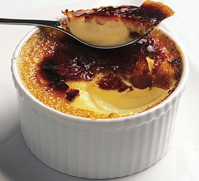

# Ginger crème brûlée

**Serves:** 6

## Ingredients
- 80 grams root ginger
- 500 ml  milk
- 500 ml whipping cream
- 150 grams caster sugar
- 200 grams egg yolks (about 10 eggs)
- 70 grams demerara sugar
- 80 grams preserved stem ginger in syrup (finely diced, optional)

## Method
1. Preheat the oven to 100°C. Peel the root ginger, grate it finely, then place into a square of muslin and squeeze out as much juice as possible into a small dish.
1. Put the milk, cream and 90 grams of the caster sugar into a pan and heat, stirring regularly with a balloon whisk, until the sugar is dissolved, then bring slowly to the boil. 
1. Meanwhile, lightly whisk the egg yolks and remaining caster sugar in a bowl.
1. As soon as the milk and cream mixture comes to the boil, pour it a little at a time onto the egg yolks and sugar, whisking all the time, then add the ginger juice.
1. Divide the mixture between individual gratin dishes about 15 cm in diameter. 
1. Cook in the oven for 50 - 55 minutes, or until very lightly set and still wobbly in the middle. 
1. Place the dishes on a wire rack and leave to cool, then refrigerate until ready to serve.
1. Just before serving, sprinkle the demerara sugar over the surface of the crème brûlées and caramelise, either using a cook's blowtorch or under a very hot grill, until a fine, pale, nut brown crust has formed. 
1. Top with the preserved ginger dice, if using, and serve at once.