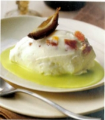

# Marscapone with dates and candied peel

*This simple dessert takes only minutes to assemble. A few turns of the pepper mill over the quenelle makes this dessert triumphant.*

**Serves:** 4

## Ingredients
- 120 grams Candied fruit peel (preferably grapefruit)
- 4 dates
- 200 grams mascarpone cheese
- 200 ml whipping cream
- 200 ml Crème anglaise (preferably pistachio)

## Method
1. Cut the candied grapefruit peel strips into large dice. 
1. Quarter and stone the dates. Set aside 4 date quarters and a spoonful of the candied peel for decoration. Dice the rest of the dates.
1. Put the mascarpone into a large bowl. In another bowl, whip the cream to a ribbon consistency, then fold into the mascarpone using a rubber spatula.
1. Now fold in the diced dates and candied fruit, without overworking.
1. Using 2 large spoons dipped in hot water, shape a quenelle from the mascarpone mixture and place on an individual plate. 
1. Repeat for the other 3 servings. Decorate with the reserved date pieces and candied fruit.
1. Pour a little Crème anglaise around each quenelle and serve chilled.