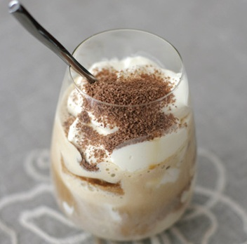

# Tiramisu

**Serves:** 4

*The Amaretto in this Tiramisu really enhances the flavour and aroma of this classic Italian dessert.*

## Ingredients
- 90 ml  Amaretto liqueur
- 300 ml Espresso coffee (cold)
- 45 grams caster sugar
- 250 ml double cream (whipped)
- 2 eggs (separated)
- 250 grams mascarpone cheese
- 30 Savoiardi Biscuits
- cocoa powder (to dust)

## Method
1. Pour the coffee into a large bowl, mix in 3 tablespoons of Amaretto liqueur and set aside.
1. Beat the egg yolks and sugar in another large bowl for about 5 minutes until thick and pale. 
1. Add the mascarpone cheese and beat thoroughly to mix. 
1. Use a metal spoon to gently fold in the whipped cream.
1. Beat the egg whites in a third large bowl until soft peaks form. 
1. Fold them quickly, but gently into the cream mixture, add the remaining liqueur, trying not to lose the volume.
1. Dip each biscuit into the coffee for just 2 seconds and no longer, otherwise the biscuits will go soggy. 
1. Drain and use to cover the bottom of 4 dessert glasses. 
1. Spoon some of the cream mixture over the biscuits, and then repeat the process. 
1. Smooth the surface with a knife, cover with cling film and chill for about 2 hours to allow the flavours to combine.
1. Just before serving, dust with cocoa powder (Do not dust earlier than this or the cocoa will turn the tiramisu bitter)