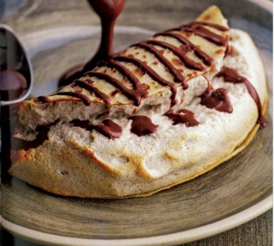

# Banana soufflé crêpes with chocolate sauce

*This recipe is tricky to make successfully in smaller quantities. If there are four of you, it is advisable to serve two crêpes each, which is easy to do so as they are light and deliciously indulgent.*

**Serves:** 8

## Ingredients
- 4 perfectly ripe medium bananas
- juice of half a lemon
- 50 ml milk
- 3 egg yolks
- 60 grams caster sugar
- 1 tablespoon potato flour / starch
- 7 egg whites
- 8 crêpes (trimmed to about 16 cm diameter)
- 30 grams butter (to grease)
- chocolate sauce (to serve)

## Method
1. Preheat the oven to 190°C.
1. Put the bananas, unpeeled, on a baking tray and cook in the oven for 5 minutes.
1. Turn them over and cook for a further 5 minutes; the skin will be black when you remove them from the oven.
1. Set aside to cool for 10 minutes.
1. Using a small knife, remove the skins from the bananas and press the flesh through a sieve of fine mouli, to give you between 350 and 400 grams of purée.
1. Put the banana purée into a small saucepan with the lemon juice, stir with a whisk and add the milk.
1. Bring to the boil over a gentle heat, stirring every minute or so.
1. Meanwhile, whisk the egg yolks with 20 grams of the caster sugar in a small bowl.
1. After 1 minute, add the potato flour and mix well, then pour this into the boiling banana and milk mixture, stirring with a balloon whisk.
1. Simmer, still stirring, for 1 minute.
1. Remove from the heat, cover with cling film and set aside.
1. Lower the oven to 180°C.
1. In a clean bowl, whisk the egg whites to soft peaks.
1. Add the remaining 40 grams of caster sugar and continue to whisk to firm peaks, making sure that they are not overly stiff.
1. Using a balloon whisk, incorporate one-third of the whisked egg whites into the cooled banana mixture, then gently fold in the remainder, using a rubber spatula.
vPlace each crêpe on a small piece of lightly buttered baking parchment on a baking sheet.
1. Drop a generous spoonful of banana soufflé mixture on one half of each crêpe, then using a palette knife to fold the other half of the crêpe over the soufflé  to enclose it, without pressing down.
1. Place in the oven for 5 minutes.
1. As soon as the crêpes come out of the oven, use a large palette knife to transfer them carefully, one at a time, from the greaseproof paper to warmed serving plates.
1. Drizzle a little chocolate sauce decoratively over each crêpe and serve immediately.
1. Offer the remaining chocolate sauce on the side.