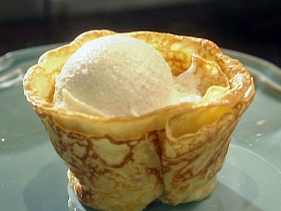

# Crêpes

*Typically French, these classic crêpes can be filled with numerous delicious ingredients, ranging from lemon and sugar, to crème patissière and fruits. The choice is limited only by the imagination.*

*The vanilla extract can be replaced by orange water or a little grated lemon zest.*

**Yield:** 16 - 18

## Ingredients
- 125 grams plain flour
- 15 grams caster sugar
- pinch of salt
- 2 eggs
- 325 ml milk
- 100 ml double cream
- few drops of vanilla extract
- 20 grams clarified butter (to cook)

## Method
### To make the batter
1. Put the flour, sugar and salt into a bowl.
1. Add the eggs, mix well with a whisk, then stir in 100 ml of the milk to make a smooth batter.
1. Gradually stir in the rest of the milk and the cream.
1. Leave the batter to rest in a warm place for about an hour.

### To cook
1. Give the batter a stir and flavour with the vanilla extract,
1. Brush a 22 cm crêpe pan with a little clarified butter and heat.
1. Ladle in a little batter and tilt the pan to cover the base thinly.
1. Cook the crêpe for about 1 minute.
1. As soon as little holes appear on the surface of the crêpe, turn it over and cook the other side for 30 - 40 minutes.
1. Transfer to a plate and cook the rest of the batter, stacking the crêpes interleaved with greaseproof paper as they are cooked.