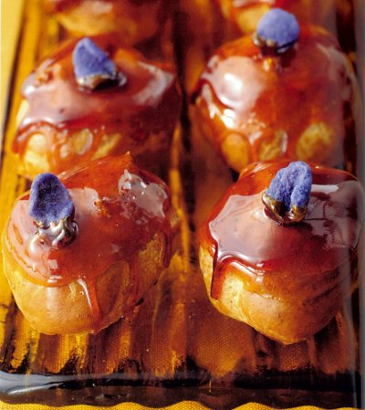

# Chocolate salammbos

*Be generous with the caramel topping for these chocolate cream-filled choux, allowing it to drizzle over the sides.*

**Serves:** 24

## Ingredients
- 1 quantity fresh [choux paste](../../baking/pastry/choux-pastry.md) (still warm)
- 300 grams caster sugar
- 24 crystallised violets
- 500 grams chocolate crème pâtissière
- 200 ml [crème chantilly](../../baking/cremes/creme-chantilly.md)

## Method
### Make the salammbos
1. Preheat the oven to 180°C.
1. Line a baking sheet with greaseproof paper.
1. Put the choux paste into a piping bag fitted with a 1.5 cm plain nozzle and pipe 24 roughly pear-shaped choux, 4 cm wide at the start and extending to 6 cm long, in staggered rows.
1. Bake the salammbos for 25 minutes until crisp and dry on the outside and base, but still soft inside.
1. Transfer to a wire rack and leave until cold.
1. Carefully cut a small hole in the bases with a knife tip.

### For the caramel
1. Put 50 ml water and the sugar into a heavy based saucepan and slowly bring to the boil, skimming the surface as it begins to bubble.
1. Dip a very clean pastry brush into cold water and brush down the inside of the pan near the boiling sugar to prevent it crystalising.
1. When the temperature reaches 160°C and the sugar has almost caramelised, lower the heat and cook to a pale amber caramel.
1. Immediately plunge the base of the pan into cold water for 10 seconds to stop further cooking.
1. One at a time, dip the top of the salammbos into the caramel to coat thickly, then invert onto a baking sheet.
1. Immediately place a crystallised violet on top of each one before the caramel sets.

### To fill
1. Mix the chocolate crème pâtissière into the chantilly cream lightly with a whisk, without overworking.
1. Put it into a piping bag fitted with a 1 cm plain nozzle and pipe it into the salammbos through the hole in the base