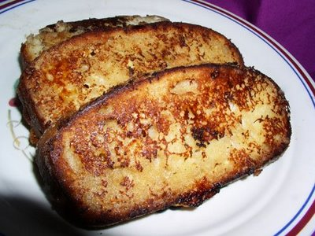

# Pain perdu

*Pain perdu or French toast is bread that has been soaked in eggs then fried. Milk, sugar and cinnamon are often mixed in with the pain perdu, and butter, fruit and syrup are sometimes served on top.*

**Serves:** 4

## Ingredients
- 600 grams [brioche dough](../../baking/pastry/brioche-dough.md)
- 120 grams sultanas
- 1 egg yolks (mixed with 2 tablespoons milk)
- 250 ml cold milk
- 50 ml crème fraîche 
- 30 grams caster sugar
- 1 whole egg
- 1 egg yolk
- pinch of salt
- 140 grams butter
- 50 grams granulated sugar to sprinkle

## Method
1. Knead the sultanas into the brioche dough, then shape into a roll 3 cm in diameter, on a lightly floured surface and place on a baking tray.
1. Leave for 1½ hours at about 24°C until nearly doubled in size.
1. Preheat the oven to 200°C.
1. Brush the brioche with the glaze.
1. Using a sharp knife, dipped in cold water, slice the brioche at 2 cm intervals at a depth of 1 cm.
1. Bake in the oven for 10 minutes, then lower the temperature to 170°C and bake for a further 20 minutes.
1. Allow to cool on a wire rack.
1. Put the milk, crème fraîche, sugar, egg, egg yolks and salt into a bowl and mix together lightly, using a balloon whisk.
1. Cut the brioche into at least 8 slices, about 1.5 cm thick.
1. Pour the milk and egg mix into a shallow dish large enough to fit all the brioche slices.
1. Lay the sliced in the dish to soak and turn them over after 2 minutes.
1. In a large non-stick frying pan, heat 80 grams of the butter.
1. When it begins to foam, lay the brioche slices in the pan.
1. After 1 minute, add the remaining butter in little pieces in between the brioche slices. and turn the slices over; they should be light brown in colour.
1. Cook for 1 - 2 minutes on the other side until nicely golden, then sprinkle with the granulated sugar.