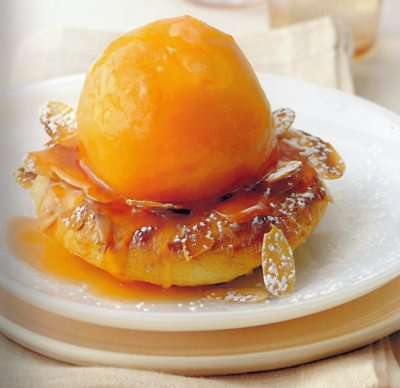

# Roasted peaches on choux crowns

*This is a lovely way to serve fresh peaches at the height of their season. For the best flavour, use perfectly ripe fruit.*

**Serves:** 4

## Ingredients
- 4 ripe peaches
- ½ quantity freshly made [choux paste](../../baking/pastry/choux-pastry.md)
- eggwash (1 egg yolk mixed with 1 tablespoon milk)
- 25 grams flaked almonds
- 75 grams caster sugar
- 100 grams butter
- 1 tablespoon grenadine syrup (optional)
- juice of 1 lemon
- icing sugar (to dust)

## Method
### To peel the peaches
1. Lightly run the tip of a knife around the circumference of each peach, then immerse them in a pan of boiling water.
1. As soon as the skin starts to lift along the incision, take out the peaches and refresh them in a bowl of iced water.
1. Remove and pull off the skin.
1. Put the peaches in a roasting dish, cover and leave to cool.

### To make the choux crowns
1. Preheat the oven to 200°C.
1. Put the choux paste into a piping bag fitted with a 7 mm plain nozzle.
1. Pipe 4 discs, 6 - 7 cm in diameter onto a lightly greased baking sheet.
1. Brush with eggwash and sprinkle with the almonds.
1. Bake for about 20 minutes, propping the oven door slightly ajar halfway through the cooking to allow the steam to escape (the choux will become crisp on the outside).
1. Transfer the crowns to a wire rack and increase the oven temperature to 220°C.

### To roast the peaches
1. Melt the sugar and butter in a small pan and cook gently, stirring with a wooden spatula to make a very pale caramel.
1. Carefully add the grenadine syrup if using, and the lemon juice.
1. Still stirring, let bubble gently for 5 minutes.
1. Spoon the caramel over the peaches and roast in the oven for about 10 minutes, basting them every 3 or 4 minutes (allow an extra 5 minutes roasting if the peaches are not very ripe).
1. Leave to cool completely, basting every 10 minutes with the caramel until the peaches are cold.

### To serve
1. Put the choux crowns on individual plates.
1. Using a palette knife, place a roasted peach in the middle of each crown and dust with a veil of icing sugar.
1. Spoon a little caramel over the peaches and serve the rest separately in a small jug.