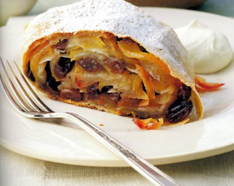

# Apple strudel

*This classic German dessert works especially well when the pastry is so thin it is nearly transparent.*

**Serves:** 6

## Ingredients
- 1 sheet of [filo](../../baking/pastry/filo-pastry.md) (55 x 20 cm)
- 100 grams raisins
- 1 tablespoon rum (optional)
- 4 apples
- juice of 1 lemon
- 60 grams caster sugar
- 1 teaspoon ground cinnamon
- 30 grams icing sugar
- clotted cream (to serve)

## Method
### Make the filling
1. Blanch the raisins in boiling water for 2 minutes, drain and refresh in cold water, then drain well.
1. Peel, halve and core the apples, then cut each half into 2 mm thick slices.
1. Place in a bowl with the lemon juice, caster sugar, cinnamon, blanched raisins and rum (if using).
1. Mix gently, cover with cling film and leave to stand for 15 minutes.

### Make the strudel
1. Preheat the oven to 180°C.
1. Lay the filo on a tea towel with one of the short edges facing you.
1. Spread the filling evenly over the whole surface.
1. Starting from the edge closest to you and using the tea towel to help, roll the filo into a sausage shape, enclosing the filling and applying light pressure as you go.
1. Carefully lift the rolled apple strudel onto the baking sheet and bake for 30 minutes until golden and crisp.
1. Using a large palette knife, slide the warm strudel onto a wire rack.
1. Dust the strudel liberally with icing sugar and place on a serving platter.
1. Cut at the table into 2.5 cm thick slices, served with clotted cream.