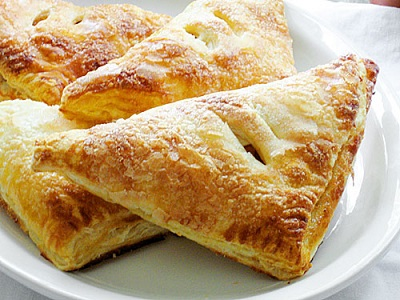

# Apple turnovers

*As a change, try flavouring the filling with vanilla, star anise or orange blossom water instead of cinnamon.*

**Serves:** 4

## Ingredients
- 360 grams [feuilletage](../../baking/pastry/puff-pastry.md) (classic puff pastry)
- 400 grams apples (preferably Cox's)
- juice of 1 lemon
- 60  grams caster sugar
- ½ teaspoon ground cinnamon
- eggwash (1 egg yolk mixed with 1 tablespoon milk)
- 20 grams icing sugar (to glaze)

## Method
### Make the filling
1. Peel, quarter and core the apples.
1. Cut the apple flesh into tiny dice.
1. Place the apple in a saucepan with the lemon juice, caster sugar, cinnamon and 50 ml of water.
1. Bring to a low simmer, cover and cook gently for 15 minutes.
1. Stir the apples with a whisk.
1. Increase the heat and, still stirring with the whisk, cook for 2 minutes to dry out the compote and give it a semi-firm consistency.
1. Take off the heat and leave to cool completely.

### Make the turnovers
1. On a lightly floured surface, roll out the pastry to a 45 x 16 cm rectangle, about 3 mm thick.
1. Turn it so a long side is parallel to you and spoon the cold apple compote into 4 mounts along this side, starting 4 cm in from the edge and leaving a 6 cm space between each mound.
1. Dip a pastry brush in cold water and brush the pastry around the mounds, then fold the half of the pastry furthest from you over the compote, making sure the edges are well aligned.
1. Lightly press the pastry all round the mounds with your fingertips.
1. Position a fluted 10 cm diameter pastry cutter so that half is on the pastry, and half on the work surface, and cut out 4 semi-circles enclosing the compote mounds.
1. Place these on a baking sheet lightly moistened with cold water.
1. Refrigerate for 20 minutes.

### Bake the turnovers
1. Preheat the oven to 200°C.
1. Brush the tops of the turnovers with eggwash and score the pastry very lightly with a knife tip.
1. Bake the turnovers for 18 minutes.
1. Increase the oven setting to 220°C.
1. Dust the turnovers with a veil of icing sugar and bake for another 2 - 3 minutes to glaze.
1. As soon as the tops are caramelised, transfer to a wire rack with a palette knife.
1. Serve the apple turnovers warm, but not hot.