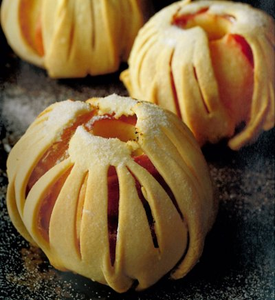

# Baked apples in a pastry cage

*Enveloped in crisp sugar-glazed pastry is an impressive way to serve baked apples.*

**Serves:** 4

## Ingredients
- 520 grams [pâte brisée](../../baking/pastry/shortcrust-pastry.md) (Shortcrust pastry)
- 8 dates (pitted and diced)
- 50 ml very fragrant jasmine tea
- 4 medium crisp apples (preferable Cox's)
- 30 grams caster sugar (to dust)

## Method
### Prepare the fruit
1. Put the dates in a bowl and pour the tea over them and leave to infuse for 20 minutes.
1. Prise out the core from each apple, using an apple corer, and prick the skin in several places with the tip of a knife.
1. Fill the cavities with the dates.
1. Preheat the oven to 160°C.

### Prepare the pastry
1. Roll out a quarter of the pastry to a 22 cm diameter disc, 2 mm thick.
1. Cut a 2 cm hole in the centre using a pastry cutter.
1. Starting 1.5 cm from the hole, use the tip of a small sharp knife to make a series of 4 cm long incisions in the pastry, 1 cm apart, radiating out from the hole.
1. Make short 1.5 cm cuts inwards from the outer edge at 1.5 cm intervals to make a serrated border.

### Assemble the cage
1. Brush an apple with water, then immediately lift the pastry disc with a palette knife and place it over the apple.
1. Brush a little water over the base of the apple, gather the edges of the pastry underneath and press together with your fingertips to seal it.
1. Put the 'caged' apple on a baking sheet and prepare the others in the same way.
1. Bake in the oven for about 90 minutes, checking with a knife tip that the apples are cooked; it should slide in with no resistance.
1. Remove the apples from the oven, dust with the sugar and glaze with a cook's blowtorch or place under a very hot grill until the sugar begins to melt on the pastry.
1. Serve within half an hour.