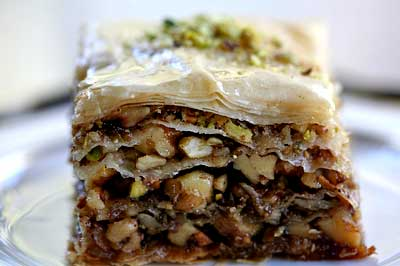

# Baklava

*This sweet pastry made from layers of filo pastry, filled with chopped nuts and honey is a typical dish of the former Ottoman empire.*

**Serves:** 8

## Ingredients
- 16 sheets of [filo](../../baking/pastry/filo-pastry.md)
- 400 grams pistachios (skinned)
- 60 grams caster sugar
- 1 tablespoon ground cinnamon
- 140 grams butter (melted and cooled)

### Syrup
- 250 ml clear honey
- 80 grams caster sugar
- pared zest of 1 lime
- 1 cinnamon stick
- 2 cloves

## Method
### Make the syrup
1. Put 160 ml of water in a heavy-bases saucepan with the honey, sugar, lime zest and spices.
1. Heat slowly to dissolve the sugar, then simmer for about 20 minutes until thick enough to lightly coat the back of a spoon.
1. Strain through a chinois or fine-meshed conical sieve and keep hot.

### To assemble
1. Line a round or oval oven-proof dish, about 22 cm in diameter, 5 cm deep with buttered non-stick baking parchment.
1. Trim the filo sheets to the size of your dish.
1. Blitz the nuts, sugar and cinnamon in a blender for 10 seconds until the nuts are coarsely chopped.
1. Preheat the oven to 170°C.
1. Brush 6 sheets of filo on both sides with melted butter, and lay them one on top of another in the baking dish.
1. Cover with half the coarsely chopped pistachio mixture.
1. Brush another 4 sheets of filo with the melted butter and lay them one by one over the pistachios.
1. Cover with the rest of the pistachios.
1. Brush the last 6 sheets of filo with melted butter and lay them one by one on the pistachio filling.
1. Using a very sharp knife, cut the baklava into diamond shapes, cutting right through all the layers.

### To bake
1. Bake the baklava for 15 minutes, then lower the oven temperature to 150°C and bake for a further 30 minutes.
1. Let stand for 15 minutes, then ladle the hot syrup all over the surface of the baklava.
1. Leave to stand for at least 12 hours  before serving.

### To serve
1. Slide a palette knife down the side of the dish and under the lining paper (it may help to run a cook's blowtorch under the base and round the outside of the dish).
1. Lift the baklava out carefully onto a board and remove the paper.
1. Using a very sharp knife, cut it into diamonds, following the original markings.
1. Arrange on a platter and serve.