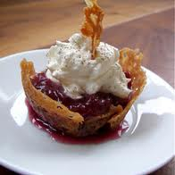

# Brandy snap baskets with rhubarb and raspberries

*These delicate fruit-filled baskets are best cooked shortly before serving and filled at the last moment. As they are fragile, it's a good idea to make a few extra to allow for breakages.*

**Serves:** 6

## Ingredients
### For the brandy snap baskets
- 100 gram butter, melted
- 100 gram caster sugar
- 100 gram golden syrup
- 100 gram plain flour
- 40 gram fresh root ginger, peeled and grated
- juice of half a lemon
- 1 tablespoon Cognac

### For the filling
- 2 young, tender rhubarb stalks
- 500 ml sirop a sorbet
- juice of 1 orange
- 250 gram crème Chantilly
- 18 perfectly ripe raspberries

## Method
### For the filling
1. Peel the rhubarb if necessary, wash in cold water, then cut into batons about 3 cm long and 5 mm across. 
1. Bring the sirop a sorbet to boil in a pan. 
1. Add the rhubarb and poach for 20 seconds, then tip the rhubarb and syrup into a dish and set aside. 
1. Simmer the orange juice in a pan to reduce by half; leave to cool.

### For the brandy snap baskets
1. Preheat the oven to 180°C. 
1. Mix the butter, sugar and golden syrup together in a bowl, using a wooden spoon. 
1. Add the flour, ginger, lemon juice and Cognac, and whisk until smooth. 
1. Using a shallow 15 cm ring, shape at least 6 rounds on a lightly buttered baking tray, spacing them 5 cm apart to allow room for spreading: fill the ring to a 3 - 4 cm depth with a little of the mixture, smooth with a spatula, then lift off the ring and repeat.
1. Cook in the oven for 3 - 5 minutes, until they turn a light caramel colour. Leave the brandy snap rounds on the tray for 30 seconds - 1 minute. 
1. Then, using a palette knife, life one and place in an individual tartlet tin, small bowl or large cup, about 6 cm in diameter and 3.5 cm high. 
1. Shape into baskets by gently pressing the brandy snap into the mould and fluting the edges. 
1. Repeat to shape the rest.
1. Leave until cold, then carefully de-mould and place on a wire rack.

### Filling the brandy snap baskets
1. Fold the orange juice into the crème Chantilly and divide between the brandy snap baskets. 
1. Arrange the raspberries and drained rhubarb on top. 
1. Serve immediately.