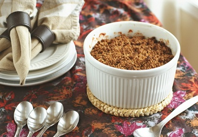

# Autumn fruit crumble

*Quince and ginger lend a wonderful fragrance to this crumble. You can vary the fruits according to the season - plums and blackberries are a good combination. Serve with crème anglaise or cream.*

**Serves:** 8 - 10

## Ingredients
### Filling
- 500 ml sirop a sorbet
- 340 grams cranberries
- 4 quince
- 1 Bramley or other cooking apple
- 4 Cox or Gala apples
- 1 lemon juice
- 180 grams caster sugar
- 80 grams preserved stem ginger in syrup

### Crumble
- 50 grams butter, cut into pieces, slightly softened
- 60 grams brown sugar
- 85 grams flour
- 15 grams ground almond
- 15 grams flaked almonds

## Method
### To prepare the filling
1. Bring the sirop a sorbet to the boil in a pan. 
1. Drop in the cranberries, remove from the heat and set aside to soak for 2 hours, or until cold. 
1. Drain and set aside. Preheat the oven to 190°C. Prick each quince in 3 or 4 places with a fork, wrap them all in a piece of foil and place on a baking tray. 
1. Bake for 1 - 1 1/4 hours until tender, turning 3 or 4 times during cooking. 
1. To test, insert a skewer into the flesh; it should go in easily. Unwrap all the quince and set aside to cool.
1. Meanwhile, peel, quarter and core all the apples, then cut the flesh into 2 cm dice. 
1. Put into a saucepan with the lemon juice and caster sugar and cook over a high heat for 5 minutes, stirring often. 
1. Remove from the heat and set aside. Using a small knife, peel, halve and core the quince, then cut the flesh into 2 cm dice.

### To make the crumble
1. Put the butter, brown sugar and flour and ground almond into a bowl. 
1. Using your fingertips, rub together until the mixture reaches a grainy, almost sandy, but still slightly uneven consistency; do not overwork.

### To assemble the crumble
1. Gently mix the cranberries, quince and apples together in a pie dish (about 22 x 30 cm). 
1. Scatter the ginger over the top, then press lightly into the fruit with your fingertips. 
1. Sprinkle the crumble topping evenly over the surface without packing it down. 
1. Before the last few layers of crumble are added to the top, mix the flaked almonds to the crumble and scatter over the top.
1. Bake at 190°C for 40 minutes. 
1. Leave to stand for 5 - 10 minutes before serving.