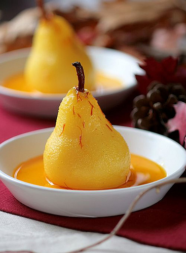

# Poached pears stuffed with figs and dates

*Simple to prepare and delectable to eat - owing to the harmonious combination of flavours - this autumn and winter dessert par excellence.*

**Serves:** 6

## Ingredients
- 6 William or conference pears (ripe)
- 1 lemon juice
- 400 grams caster sugar
- 1 cinnamon stick (broken up)
- 200 grams dates (stoned)
- 100 grams soft dried figs
- 1.5 teaspoons rum (optional)
- 400 ml Sauce caramel

## Method
1. Using a small, very sharp knife, mark a decorative scalloped shaped collar in the skin around the top of each pear, then peel away the skin from the collar to the base of the pear. 
1. Using a melon baller and working through the base, scoop out the core and pips.
1. Stand the pears upright in a saucepan just large enough to hold them snugly.
1. Pour in 1 litre of water and add the lemon juice, sugar and cinnamon stick. 
1. Slowly bring to the boil over a gentle heat and poach the pears at a light simmer for 10 - 15 minutes, depending on their ripeness. 
1. Transfer the poached pears and their syrup to a dish and set aside to cool completely.
1. Finely dice the dates and figs in a bowl. 
1. Pour on the rum (or 1 1/2 tablespoons of water) and mix together lightly using your fingertips.
1. When ready to serve, carefully drain the pears. Using a teaspoon, fill the cavity of each pear generously with the date and fig mixture, from the base. 
1. Place each pear on an individual serving plate and pour the caramel sauce all around. 
Any excess stuffing can be spooned alongside the fruit.