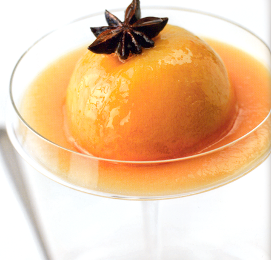

# Sweet spiced roasted peaches

*This simple dessert can be prepared in advance - ready to add the honey glaze at the last moment, for an appealing sheen.*

**Serves:** 4

## Ingredients
- 6 tablespoons runny honey
- 4 star anise
- 6 peaches
- juice of 2 lemons
- small pinch of freshly grated nutmeg

## Method
1. Preheat the oven to 180°C. Bring a medium saucepan of water to the boil. 
1. Put the honey and star anise into a small pan and heat gently for 5 minutes.
1. Meanwhile, skin the peaches. Have ready a bowl of iced water. 
1. Using the point of a knife, make a shallow incision around the middle of each peach. 
1. Using a slotted spoon, drop the peaches gently into the boiling water. 
1. As soon as the skin lifts off at the incision point, remove the peaches with the slotted spoon and immerse in the iced water. 
1. Peel the skin away from each peach with the point of a knife.
1. Place 4 of the peaches in a small roasting dish and spoon the honey over them. 
1. Roast in the oven for 8 - 10 minutes, depending on the ripeness of the peaches, basting every 2 - 3 minutes with the honey. 
1. Transfer the peaches to a plate with the star anise, and set aside to cool.
1. Pour two-thirds of the lemon juice into the honey in the roasting dish, and place over a gentle heat. 
1. Simmer gently to reduce until the glaze coats the back of a spoon. Set aside.
1. Halve, and stone the other 2 peeled peaches. 
1. Put into a food processor or blender with the remaining lemon juice and the nutmeg, and process to a smooth coulis.

### To serve
1. Divide the coulis between 4 wide serving glasses. Place a roasted peach in each glass, then coat with the almost cooled honey and top each peach with a star anise.