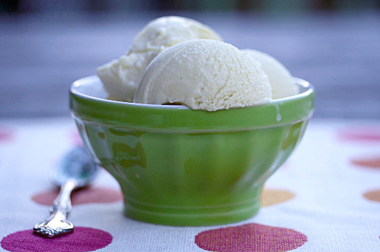

# Lavender ice cream

*Adding double cream makes this classic ice cream extra rich and creamy.*

**Prep Time:** 
**Cooking Time:** 
**Serves:** 

## Ingredients
- 750 ml [crème anglaise](../../baking/cremes/creme-anglaise.md) (warm, infused with 10 sprigs of lavender)
- 100 ml double cream

## Method
1. Pour the crème anglaise into a bowl, set over ice to hasten the cooling, stirring from time to time to prevent a skin from forming.
1. Once cold, remove the lavender and discard.
1. Stir the cream into the crème anglaise.
1. Pour the mixture into an ice-cream maker and churn for about 20 minutes, until the ice cream is firm but still creamy.
1. Transfer the ice cream to a chilled freezer-proof container for half an hour before serving.