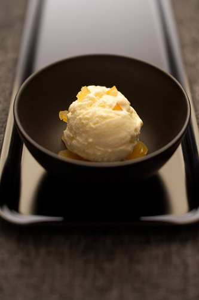

# Stem ginger ice cream

**Serves:** 8

## Ingredients
- 750 ml [crème anglaise](../../baking/cremes/creme-anglaise.md) (warm)
- 75 grams stem ginger
- 30 grams desiccated coconut
- 100 ml double cream

## Method
1. While still hot, pour the crème anglaise into a food processor with the stem ginger and whiz for one minute.
1. Strain the crème anglaise through a chinois or fine-meshed conical sieve into a bowl, set over ice to hasten the cooling, stirring from time to time to prevent a skin from forming.
1. Once cold, remove the vanilla pod and discard.
1. Stir the cream and desiccated coconut into the crème anglaise.
1. Pour the mixture into an ice-cream maker and churn for about 20 minutes, until the ice cream is firm but still creamy.