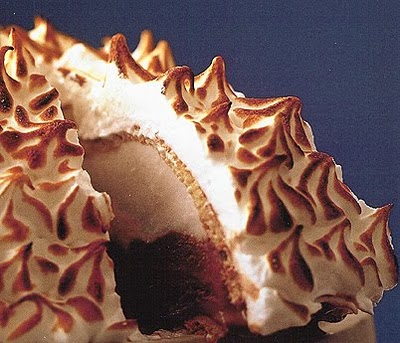

# NBaked alaskame

*To warm the meringue, you can brown it in a very hot oven at 250°C for a minute, instead of using a cook's blowtorch. This gives a lovely contrast to the frozen ice cream.*

## Ingredients
- 1 vanilla pod (split length-ways)
- 1 tablespoon instant coffee (dissolved in 1 tablespoon warm water)
- 4 tablespoons Grand Marnier

### For the sponge
- 4 eggs (separated)
- 3 egg yolks
- 85 grams caster sugar
- 35 grams plain flour
- 40 grams potato flour
- 100 grams icing sugar (sifted)

### For the crème anglaise
- 250 ml milk
- 250 ml double cream
- 125 grams caster sugar
- 1 vanilla pod (split length-ways)
- 6 egg yolks

### For the meringue Italienne
- 360 grams caster sugar
- 30 grams liquid glucose
- 6 egg whites

## Method
### For the sponge
1. Preheat the oven to 180°C.
1. In a bowl, whisk the 7 egg yolks with two-thirds of the caster sugar until you have a ribbon consistency.
1. In a separate bowl, whisk the egg whites to soft peaks, then whisk in the remaining caster sugar until the mixture holds firm peaks.
1. Carefully fold one-thirds of the whisked whites into the yolks until evenly combined, then gently fold in the rest of the whisked whites, taking care not to overwork it.
1. Sift the two flours together over the mixture and gently fold in, stopping stirring as soon as the mixture becomes smooth.
1. Spread the sponge mixture in a non-stick loaf tin, 20 - 22 cm long, to two-thirds full.
1. Bake for 25 minutes.
1. Leave in the tin for 5 minutes, then turn out on to a wire rack to cool.
1. Cut a 2 cm slice off the top for the 'lid'.
1. Using a knife and a spoon, hollow out the inside of the sponge to create a large cavity.

### For the meringue Italienne
1. Put 80 ml of water into a heavy-based pan, and add the sugar and glucose.
1. Bring to the boil over a medium heat, stirring with a skimmer.
1. Skim off any scum and brush down any crystals forming on the side of the pan using a brush dipped in cold water.
1. Increase the heat and put a sugar thermometer in the pan.
1. When the temperature reaches 110°, start to beat the egg whites in a clean bowl, using an electric whisk, or by hand.
1. Keep an eye on the sugar syrup, and remove from the heat the moment it reaches 121°C.
1. When the egg whites form stiff peaks, slowly pour in the sugar syrup in a thin, steady stream, whisking constantly as you do so.
1. Continue beating on a low speed for about 15 minutes, until the mixture has cooled to about 30°C.

### For the crème anglaise
1. Scrape the seeds out of the vanilla pod and put them in to the milk.
1. Put the milk, cream, two thirds of the sugar and the vanilla pod into a heavy-based saucepan and slowly bring to the boil.
1. Meanwhile, whisk the egg yolks and remaining sugar together in a heatproof bowl. 
1. Continue to whisk until the mixture becomes pale and has a light ribbon consistency.
1. Pour the boiling milk on to the egg yolks, whisking continuously, then pour the mixture back in to the saucepan.
1. Cook over a very low heat, stirring with a wooden spatula. 
1. Do not let the mixture boil or it will curdle.
1. The crème anglaise is ready when it has thickened slightly - just enough to coat the back of the spatula. 
1. Immediately take off the heat.
1. Unless you are serving the crème anglaise warm, strain through a fine sieve into a bowl set over crushed ice to cool, stirring occasionally to prevent a skin forming.    

### For the ice cream
1. Divide the crème anglaise between 2 bowls.
1. Scrape the vanilla seeds into one bowl and whisk to incorporate.
1. Add the coffee to the second bowl, whisking to mix well.
1. Churn the vanilla ice cream in an ice cream machine for 15 - 20 minutes, then freeze in a suitable container.
1. Churn the coffee ice cream in an ice cream machine for 15 - 20 minutes, then freeze in a suitable container.

### To assemble
1. Brush the Grand Marnier over the inside of the hollowed-out sponge, and over the lid.
1. Place the sponge base on a large piece of cling film and fill with alternate scoops of vanilla and coffee ice cream, so that the ice cream comes at least 2 - 3 cm above the top of the sponge.
1. Put the lid on top, then bring up the sides of the cling film and wrap the whole dessert.
1. Place in the freezer for 1 - 2 hours.

### To serve
1. Remove the cling film and place the dessert on a heat-proof serving tray.
1. Put the meringue into a piping bag fatted with a 1.5 - 2 cm fluted nozzle and pipe over the top and sides of the dessert to cover it completely.
1. With a cook's blowtorch, lightly brown the meringue all over.
1. Serve at once, cutting the baked alaska into slices with a very sharp knife dipped in hot water between each slice.