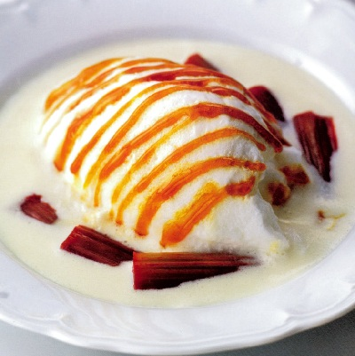

# Floating islands with rhubarb

**Serves:** 4

## Ingredients
- 2 young, tender rhubarb stalks
- 250 ml crème anglaise

### For the meringue
- 1 litre of milk
- 190 grams caster sugar
- 6 egg whites

### For the syrup
- 150 grams caster sugar

### For the caramel
- 210 grams caster sugar

## Method
1. Peel the rhubarb, if necessary, then rinse and cut into 5 cm long batons, 2 cm wide.
1. Place in a dish.
1. Dissolve the sugar for the syrup in 250 ml water in a saucepan over a medium heat and bring to the boil.
1. Immediately pour over the rhubarb and set aside.

### To make the meringue
1. Put the milk and 60 grams of the sugar in a sauté pan, heat to about 85°C and lower the heat to maintain this temperature.
1. Beat the egg whites using an electric whisk to firm peaks, then beat in the remaining sugar; the meringue should hold stiff peaks.
1. Using a large serving spoon, scoop out a quenelle of meringue and smooth it using a palette knife.
1. Drip the quenelle into the hot milk; the quenelle will slide off the spoon into the pan.
1. Rinse the spoon in cold water, then repeat to make 4 quenelles  in total.
1. Poach in the milk for 2 minutes, then turn carefully, using a slotted spoon, and poach for 2 minutes more.
1. Carefully life out the quenelles and lay on a clean tea towel.

### To make the caramel
1. Melt the sugar in a small pan over a low heat.
1. As soon as the syrup turns a light golden caramel colour, remove from the heat.

### To serve
1. Divide the crème anglaise between 4 shallow bowls.
1. Use a palette knife to transfer a quenelle to each bowl.
1. Drain the rhubarb and arrange around the 'islands'.
1. Drizzle the caramel decoratively over the 'islands'.
1. Leave for 5 minutes before serving.