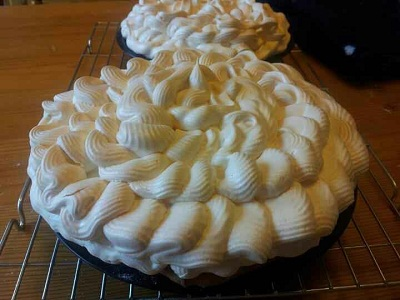

# Lemon and orange meringue pie

*This delightful lemon meringue pie sits in a wonderful biscuit like shortbread pastry with a slightly sharp rich sweet lemon filling, ending with a light airy crunch of meringue.*

**Serves:** 8

## Ingredients
### For the pastry
- 250 grams flour(sifted)
- 200 grams butter
- 100 grams icing sugar(sifted)
- 1 pinch salt
- 2 egg yolks
- 1 drop vanilla essence

### For the filling
- 2 level tablespoons cornflour
- 100 grams golden caster sugar
- finely grated zest 2 large lemons
- 125 ml fresh lemon juice (from 2-3 lemons)
- juice 1 small orange
- 85 grams butter (cut into pieces)
- 3 egg yolks
- 1 whole egg

### For the meringue
- 4 egg whites (at room temperature)
- 200 grams golden caster sugar
- 2 level teaspoons cornflour

## Method
### To make the pastry
1. Sift the flour onto the work surface and make a well in the centre. 
1. Dice the butter and place it in the well, then work it with your fingertips until very soft.
1. Sift the icing sugar onto the butter, add the salt and work into the butter. 
1. Add the egg yolks and mix well. Gradually draw in the flour and mix until completely amalgamated.
1. Add the vanilla essence and rub into the dough 2 or 3 times with the palm of your hand.
1. Cover with polythene, and refrigerate for several hours before use.

### To bake blind
1. Pre-heat oven to 200°C.
1. Line a pastry or tart tin with butter and sprinkle some flour over the butter to stop the pastry from sticking.
1. Roll out the pastry to a thickness of about 3 mm and gently wrap it around a rolling pin.
1. Lay the pastry over the tin so it covers it completely.
1. Line the tin with the pastry and press down around the edges with a piece of spare pastry.
1. Carefully cut around the edge of the pastry with a sharp knife.
1. Using a fork, prick holes in the base of the pastry to allow air to flow through whilst baking.
1. Line the pastry with a sheet of baking parchment, and fill the parchment with baking balls.
1. Place the pastry in the oven and cook for 15 minutes.
1. Take the pastry out of the oven, remove the baking parchment and baking balls.
1. Return the pastry to the oven and cook for a further 5 - 8 minutes, or until the base of the pastry is golden.
1. Remove from the oven and leave to cool.

### To make the filling
1. In a medium saucepan, mix together the cornflour, sugar and lemon zest.
1. Carefully strain the lemon juice through a chinois or fine-meshed conical sieve in to the saucepan, mixing it to a paste.
1. Strain the orange juice through the sieve or chinois into a measuring jug, adding enough water to make the juice up 20 200 ml.
1. Pour the orange mixture into the lemon mix.
1. Cook over a medium heat, stirring constantly, until thickened and smooth.
1. Once the mixture begins to bubble, remove from the heat and mix in the butter.
1. Beat together the egg yolks and the whole egg and stir this into the pan.
1. Return the pan to a medium heat and stir constantly until the mixture thickens. It will bubble but will not curdle.
1. Remove from the heat and set aside.

### To make the meringue
1. Put the egg whites in a large bowl.
1. Whisk to soft peaks, and then add the sugar a little at a time, whisking gently without over beating.
1. whisk in the cornflour, then add the rest of the sugar.
1. Continue whisking until the mixture is smooth and thick.

### To assemble
1. Gently re-heat the lemon mixture and pour into the pie case.
1. Using a piping bag, gently pipe the meringue mixture around the outside of the pastry, slowly working towards the centre of the pie.
1. Repeat this process, working an inch away from the edge of the tart each time.
1. Return the meringue to the oven and bake for 18 - 20 minutes until the meringue is crisp and slightly colour.
1. Let the pie sit in the tin for 30 minutes before removing.
1. Leave to cool for at least an hour before slicing.
1. Eat the same day.