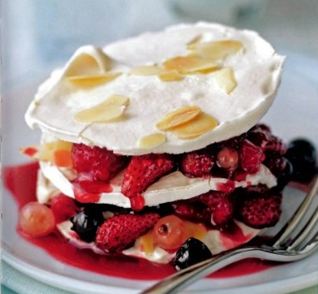

# Meringue and red berry layers

*The meringue, fruit and coulis can all be prepared a day ahead, ready to assemble quickly as you are about to serve. For total indulgence, serve with a scoop of vanilla ice cream.*

**Serves:** 6

## Ingredients
- 275 grams [meringue Francaise](../../baking/meringue/meringue-francais.md)
- 50 grams flaked almonds (lightly toasted)
- 400 ml sirop a sorbet
- 500 grams ripe mixed berries
- juice of 1 lemon

## Method
### To make the meringues
1. Preheat the oven to 100°C.
1. Draw 9 circles, 7 - 8 cm in diameter, on 2 large baking sheets, lined with baking parchment and invert the paper.
1. Using a palette knife, spread a 4 mm layer of meringue over each marked circle and smooth with a palette knife.
1. Sprinkle all the rounds with the flaked almonds.
1. Cook in the oven for 1 hour, then set aside to cool.
1. When cold, carefully remove from the baking parchment and leave in a dry place until ready to assemble.

### To make the syrup
1. Bring the sirop a sorbet to the boil in a pan, then reduce to a simmer.
1. Put the firmer fruits in first, then every 30 seconds add another variety, finishing with the softest fruits.
1. Immediately remove from the heat and leave to cool.
1. Carefully drain the fruits over another pan to collect the syrup.
1. Take about a fifth of the least shapely poached fruits and add to the sirop a sorbet.
1. Cook over a medium heat for 10 minutes, then tip into a blender.
1. Add the lemon juice and blend for 30 seconds, then strain through a chinois or fine-meshed conical sieve into a clean bowl and set aside.

### To serve
1. Place a meringue round on each serving plate.
1. Carefully spoon some of the poached fruits onto each meringue and coat with a little of the coulis.
1. Cover with another meringue round and spoon on the remaining fruits.
1. Coat with more coulis, then top with a final meringue round.
1. Spoon more coulis around the plate and serve at once.