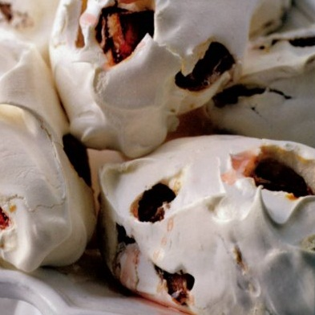

# Plum meringues

*These are delicious eaten within 24 hours of making, with the plum juice slightly oozing from them. You can also substitute the plums for fresh stoned cherries.*

**Serves:** 4

## Ingredients
- 300 grams plums
- 300 ml sirop a sorbet
- 2 bay leaves
- 275 grams [meringue Francaise](../../baking/meringue/meringue-francais.md)

## Method
1. Using a small knife, remove the stones from the plum, without cutting them entirely in half and place in a dish.
1. Heat the sirop a sorbet with the bay leaves in a saucepan over a medium heat.
1. As soon as it reaches the boil, pour the syrup over the plums and set aside to cool completely.
1. Preheat the oven to 100°C.
1. Line a baking sheet with baking parchment or a silicone liner.
1. Drain the cooled plums and dab them lightly on kitchen paper to remove as much syrup as possible.
1. Using a large spoon, fold them lightly into the meringue mixture.
1. Using 2 large spoons, take a quarter of the meringue and shape into a large quenelle by passing it between the spoons, then place on the prepared baking sheet.
1. Repeat to make another 3 meringues.
1. Cook in the oven for 2 hours.
1. Leave the meringues on the baking sheet to cool a little, then using a palette knife to transfer them to a wire rack.
1. Leave in a dry place to cool completely before serving.