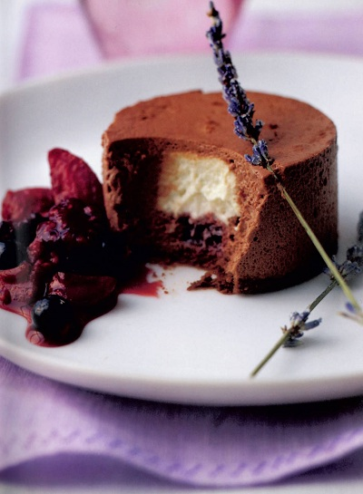

# Chocolate mousse, lavender crémeux and berry compote

*This recipe really isn't suitable to make in small quantities, but the individual desserts freeze very well, for up to 15 days without diminishing at all in quality.*

*You will need 12 x 6.5 cm metal rings about 3.5 cm high.*

**Serves:** 12

## Ingredients
### Berry compote
- 200 grams caster sugar
- 400 grams mixed red berries
- juice of 1 lemon

### Base
- 400 grams chocolate Genoese sponge mixture

### Crémeux
- 3 egg yolks
- 40 grams caster sugar
- 250 ml single cream
- 3 grams lavender flowers (not in full blossom)
- 1 sheet leaf gelatine

### Chocolate mousse
- 200 grams dark chocolate (chopped)
- 150 ml [crème anglaise](../../baking/cremes/creme-anglaise.md)
- 240 ml double cream

## Method
### To make the compote
1. Dissolve the sugar in 200 ml water in a saucepan over a medium heat.
1. Bring to the boil, then immediately reduce the heat to low and simmer.
1. Add the berries, one variety at a time according to size, ripeness and fragility; The firmer fruits first ending with the softer fruits last.
1. Poach for about 2 minutes, then leave to cool in the syrup.
1. When cooled, carefully strain the berries in a chinois or fine-meshed conical sieve set over a bowl.
1. Return the syrup to the pan, let bubble over a brisk heat to reduce by two-thirds, then pour over the berries.
1. Add the lemon juice, cover and refrigerate.

### For the sponge base
1. Preheat the oven to 180°C.
1. Lay a 40 x 60 cm piece of baking parchment on a baking sheet.
1. Using a palette knife, spread the chocolate sponge mixture evenly over the parchment.
1. Bake for 5 - 6 minutes, then slide the parchment and sponge onto a wire rack and set aside to cool.
1. Once cooled, cut out 12 rounds from the sponge, using 6.5 cm metal rings, 3.5 cm high, leaving the sponge circles in the rings.
1. Carefully transfer the rings with the sponge bases to a tray.

### To make the lavender crémeux
1. Lightly mix the egg yolks and sugar together, using a small whisk.
1. Put the single cream and lavender flowers in a saucepan and slowly heat to simmering point, then pour onto the egg and sugar mix, stirring with the whisk as you do so.
1. Pour back into the saucepan and cook over a gentle heat until slightly thickened, stirring very lightly and taking care not to let the mixture go above 85°C.
1. Meanwhile, soften the gelatine in a shallow dish of cold water to cover for about 5 minutes.
1. Remove the crémeux from the heat.
1. Drain the gelatine, squeeze out excess water and add to the crémeux, stirring to dissolve.
1. Strain through a chinois or fine-meshed conical sieve, then process in a blender for 30 seconds.
1. Transfer to a bowl and leave to cool, giving a brief stir from time to time, then refrigerate to firm up.

### To make the mousse
1. Put the chocolate into a bowl.
1. Gentle heat the crème anglaise and pour over the chocolate, stirring, then use a balloon whisk to mix until melted and smooth.
1. In another bowl, whip the cream to a ribbon consistency, then gently fold into the mousse, using a rubber spatula, so you can aerate the mouse without overworking it.
1. As soon as the crémeux has firmed up, put it into a piping bag fitted with a 1 cm plain nozzle and pipe mounds 2 cm in diameter, centrally on the sponge rounds in the rings.
1. Chill for 10 minutes, until set.
1. Spoon the chocolate mouse into the rings, filling them to the top and enclosing the crémeux.
1. Tap each lightly to eliminate any air bubbles and gently smooth the surface with a palette knife.
1. Refrigerate until ready to serve.

### To serve
1. Use a cook's blowtorch or hot tea towel to briefly heat the outside of the ring, then lift it off, pushing the sponge gently up from underneath as you do so.
1. Place on a plate with a generous spoonful of berry compote alongside and serve immediately.