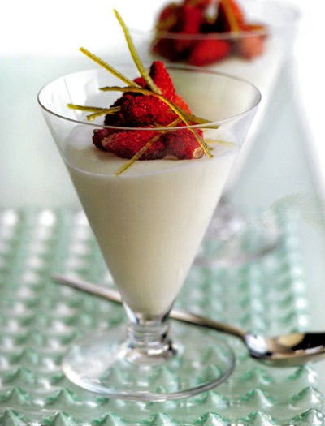

# Lime mousse with wild strawberries

*Any delicate berries can be used instead of wild strawberries, try raspberries instead.*

**Serves:** 8

## Ingredients
- 1 sheet leaf gelatine
- 100 ml lime juice
- 45 grams caster sugar
- 100 grams warm [meringue Italienne](../../baking/meringue/meringue-italienne.md)
- 170 ml whipping cream
- 10 grams lime zest (julienne)
- 250 grams hulled wild strawberries

## Method
1. Soften the gelatine in a shallow dish of cold water to cover for about 5 minutes.
1. In a small saucepan, heat half the lime juice with 15 grams of the sugar until the sugar has dissolved and the lime syrup is hot, then remove from the heat.
1. Immediately drain the gelatine and squeeze out the excess water, then add to the lime syrup, stirring until melted. Stir in the rest of the lime juice.
1. Pour the lime syrup into the meringue and mix it in lightly, using a whisk.
1. In another bowl, whip the cream to a ribbon consistency, then fold into the lime mixture using a spatula.
1. Divide between 8 glasses and refrigerate.
1. In a small saucepan, dissolve the remaining 30 grams of sugar in 6 tablespoons of water and bring gently to the boil.
1. Add the lime zest julienne and simmer for 1 minutes, stirring with a fork, then drain the zest and set aside.
1. To serve, neatly pile the strawberries on top of each lime mousse and arrange the zest julienne on top.
1. Serve lightly chilled, not too cold.