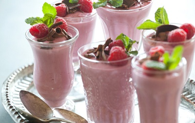

# Raspberry mousse

*An easy dessert, which also works well with strawberries, blackcurrants or blackberries. The eau-de-vie helps to bring out the flavour of the berries, but if  the fruit seems to be lacking in flavour, add a squeeze of lemon juice to the purée.*

**Serves:** 6 - 8

## Ingredients
-  ½ sheets of gelatine
- 400 grams raspberries
- 120 grams [meringue Italienne](../../baking/meringue/meringue-italienne.md)
- 100 ml whipping cream
- 2 tablespoons raspberry eau-de-vie or kirsch
- 18 raspberries to finish

## Method
1. Purée the raspberries, and tip into a chinois or fine-meshed conical sieve set over a bowl.
1. Push the purée mixture through the sieve using a ladle, discarding the harsh seeds.
1. Soak the gelatine in a shallow dish of cold water to soften for about 5 minutes.
1. Pour the raspberry purée into a bowl and mix in the meringue Italienne, using a balloon whisk.
1. In another bowl, whip the cream to soft peaks.
1. Using a rubber spatula, gently fold the whipped cream into the meringue and purée mixture.
1. Warm the eau-de-view or kirsch in a small pan to about 50°C.
1. Drain the gelatine, squeezing out the excess water and add to the alcohol, off the heat, stirring to dissolve.
1. Pour into the mousse mixture, folding it in with the spatula until evenly combined.
1. Spoon the mousse into 6 - 8 glasses and refrigerate for at least 2 hours.
1. To serve, top each mousse with a trio of raspberries.