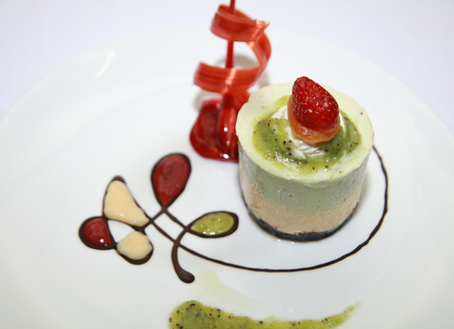

# Anise parfait

**Serves:** 8

## Ingredients
- 1 egg plus 3 egg yolks
- 50 grams caster sugar
- 100 ml whipping cream
- 100 ml double cream
- 30 ml Ricard or Pernod

### to serve
- 100 ml strawberry coulis
- 100 ml kiwi coulis
- 8 strawberries
- 100 ml Sirop a sorbet

## Method
1. Heat the sirop a sorbet in a pan until it bubbles, and immediately remove from the heat.
1. Put the egg, egg yolks and sugar into a small heatproof bowl.
1. Stand the bowl over a small saucepan one-third filled with hot water at 50 - 60°C, making sure that the bottom of the bowl doesn't touch the water in any way.
1. Place the saucepan over a gentle heat.
1. Whisk the mixture , using a balloon whisk until it reaches a ribbon consistency,
1. Immediately remove the bowl from the pan and continue to whisk until the mixture has cooled noticeably to 25 - 30°C.
1. In another bowl, whip the creams together with the Ricard or Pernod to a ribbon consistency.
1. Fold into the whisked egg and sugar mixture, using a rubber spatula, making sure you do not overwork the mixture.
1. Place 8 metal rings, 7 cm in diameter, on a baking sheet or tray lined with greaseproof paper, and divide the parfait mixture between them.
1. Cover the rings with cling film and freeze until ready to serve.
1. One at a time, briefly warm the outside of each ring using a cook's blowtorch or hot tea towel and release the parfait on to a serving plate. 
1. Using a warm spoon, carefully dribble a teaspoon of kiwi coulis on each parfait, topped with a glazed strawberry.
1. Dribble the strawberry and kiwi coulis around each parfait and serve immediately.