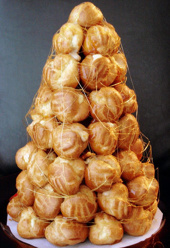

# Mini croquemebouche

**Serves:** 6 - 8

## Ingredients
### Choux pastry
- 125 ml milk
- 100 grams butter (diced, plus extra to grease)
- ½ teaspoon salt
- 1 teaspoon caster sugar
- 150 grams plain flour
- 4 eggs
- eggwash (2 egg yolks mixed with 2 teaspoons milk)

### For the filling
- 150 ml double cream
- 250 grams crème patissière
- 1 tablespoon Grand Marnier

### To assemble
- 40 grams liquid glucose
- 250 grams caster sugar
- 2 teaspoon groundnut oil (to oil the mould)

## Method
1. Preheat the oven to 180°C.

### To make the choux
1. Combine the milk, 125 ml water, the butter, salt and sugar in a saucepan set over a low heat.
1. Bring to the boil and immediately take the pan off the heat.
1. Shower in the flour and mix with a wooden spoon until smooth.
1. Return the pan to a medium heat and stir for about 1 minute to dry out the paste, then tip it into a bowl.
1. Add the eggs, one at a time, beating with the wooden spoon.
1. Once the eggs are all incorporated, the paste should be smooth and shiny with a thick ribbon consistency.

### To make the choux balls
1. Put the choux pastry into a piping bag fitted with a 5 - 7 cm plain nozzle.
1. Pipe into balls about 1 cm in diameter onto a buttered baking sheet; you will need 48 in total (plus one for testing if they are cooked)
1. Brush them with the egg glaze and bake in the pre-heated oven fro 10 minutes, until dry and crisp, but still soft inside.
1. If necessary, switch off the oven and leave the choux balls inside for a few minutes, to dry them out.
1. Transfer them to a wire rack.
1. Once they have cooled completely, make a little hole with a knife in the base of each choux ball.

### To make the caramel
1. Dissolve the sugar in 80 ml of water in a small saucepan set over a medium heat, then bring to the boil and skim if necessary. 
1. Add the liquid glucose and heat until it it reaches 160°C, wash down the sides of the pan with a brush dipped in cold water to prevent any crystals from forming.
1. Immediately remove from the heat.
1. Partially dip each choux ball into the caramel to coat the top third (the opposite end to the hole) and place on a tray, and leave until set.

### To make the filling
1. In a bowl, whip the cream to a ribbon consistency, then fold into the crème patissière with the Grand Marnier.
1. Put the mixture into a piping bag fitted with a 3 - 5 mm plain nozzle and use to fill the choux balls, piping it through the hole in the base.

### To assemble
1. Warm the remaining caramel over a very gentle heat.
1. Oil the inside of a rigid metal cone, about 18 cm in diameter and 18 cm tall.
1. Place a choux ball in the base of the cone, with the caramel side facing into the pointed end.
1. Gently spear another choux ball with the tip of a small knife and dip one-fifth of one side into the warm caramel (just enough to pick up a dab), then stick it onto one side of the first choux ball, so that the cooled caramel side is against the inside of the cone. The warm caramel will stick this choux ball to the first choux ball.
1. Proceed in this way with the remaining choux balls, arranging them up the sides of the cone and keeping the top level regular and straight as it grows, until you have used all the choux balls.
