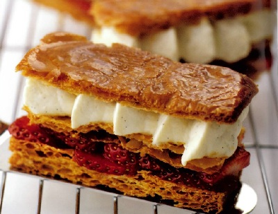

# Glazed strawberry mille-feuilles

*This is a delightful mille-feuille, light as a feather and filled with delectable vanilla cream and strawberries. The icing sugar glaze gives it a beautiful sheen.*

**Serves:** 6

## Ingredients
- 240 grams [puff pastry](../../baking/pastry/puff-pastry.md)
- 60 grams icing sugar
- 1 sheet leaf gelatine
- 350 ml warm [crème anglaise](../../baking/cremes/creme-anglaise.md) (80°C with extra vanilla)
- 50 ml whipping cream
- 300 grams strawberries (cut into 2 mm slices)

## Method
1. Roll out the pastry on a lightly floured surface to a 36 x 12 cm rectangle, 4 mm thick,
1. Cut into six 12 x 6 cm pieces and lift onto a baking sheet. Refrigerate for 20 minutes.
1. Preheat the oven to 180°C.
1. Stand a 3 cm high ring or mould in each corner of the baking sheet and put another baking sheet on top, resting on the moulds so that the pastry will be lightly compressed as it cooks.
1. Bake for 15 minutes, then lower the temperature to 170°C and cook for a further 10 minutes.
1. Take out of the oven and remove the top baking sheet and rings.
1. Raise the oven temperature to 230°C.
1. Dust the mille-feuilles with the icing sugar and return to the oven for 2 - 3 minutes to glaze; don't let them burn.
1. Using a palette knife, transfer to a wire rack to cool.
1. Soak the gelatine in cold water for 5 minutes, then drain, squeeze out the excess water and add to the warm crème anglaise, stirring until melted.
1. Let cool, then chill for 4 - 5 hours to set.
1. Whisk the crème anglaise to loosen.
1. Whip the cream to soft peaks, then fold into the custard.
1. Put the custard and cream mix into a piping bag fitted with a  Saint Honoré or 1.5 cm fluted nozzle and chill for 30 minutes.
1. Using a serrated knife, trim the pastry edges to neaten, then cut each one horizontally into three, to make 3 layers for each mille-feuille.
1. Arrange the strawberry slices on the bottom layers, cover with the middle layers and pipe the crème anglaise generously over this layer.
1. Finally, place the glazed pastry layer on top and press it down lightly to bond the layers.
1. Use a palette knife to slide the mille-feuilles onto plates and serve.