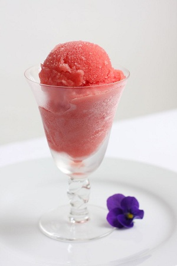

# Blood orange sorbet

*A sorbet should be on the tart side rather than overly sweet. You may need to adjust the quantity of sugar syrup according to how sweet or acidic the fruit is.*

**Serves:** 8 - 10

## Ingredients
- 170 grams caster sugar
- 30 ml liquid glucose
- 1 dried red chilli (broken into pieces)
- 1 thyme sprig
- 8 blood oranges

## Method
1. Put the sugar, liquid glucose and 200 ml of water in a pan over a medium heat.
1. Bring to the boil, skim if necessary, then add the chilli and thyme.
1. Boil for 30 seconds, then remove from the heat, cover and set aside to infuse.
1. Once cold, strain through a chinois or fine-meshed sieve into a bowl and refrigerate.
1. Cut the oranges in half and squeeze out as much juice as possible.
1. Strain through a chinois or fine meshed-sieve to remove any fibrous pulp and pips.
1. Pour the orange into the chilled syrup and stir briefly with a wooden spoon
1. Start the ice- cream machine churning, then immediately pour in the sorbet mixture.
1. After 15 - 20 minutes, turn off the machine and use a spatula to bring the partially set sorbet around the sides into the middle.
1. Churn for a further 10 minutes, or until the sorbet reaches a firm consistency.
1. Turn the machine off.
1. Scoop the sorbet into serving glasses, using an ice-cream scoop dipped in cold water.