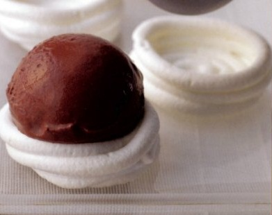

# Chocolate sorbet

*The contrast of dark with white, and of the crisp meringue with the soft sorbet, makes this dessert particularly special. You can make the meringue nests the day before, or if you prefer, serve the sorbet as it is.*

**Serves:** 8

## Ingredients
- 100 ml milk
- 150 grams caster sugar
- 30 grams dark, bitter cocoa powder
- 100 grams dark chocolate couveture (chopped)
- 8 meringue nests

## Method
1. Put 400 ml of water into a saucepan with the milk, glucose and cocoa powder.
1. Bring to the boil over a medium heat, whisking with a balloon whisk.
1. Lower the heat to a simmer for 2 minutes.
1. Remove from the heat, add the chopped chocolate and stir with a whisk for 2 minutes until melted.
1. Strain through a chinois or fine-meshed conical sieve into a bowl and set aside to cool, whisking from time to time.
1. Once cooled, cover and refrigerate for an hour.
1. Start the ice-cream machine churning, then immediately pour in the sorbet mixture.
1. Churn for 15 - 20 minutes, until thick.
1. Turn off the machine.
1. Place a meringue nest on each serving plate, and using an ice cream scoop, dipped in hot water, place a scoop of sorbet on each nest.
1. Serve immediately.