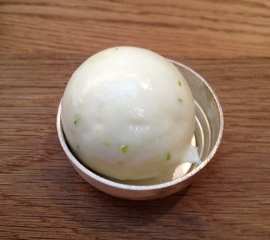

# Thyme-scented fromage frais sorbet

*When they are in season, raspberries or wild strawberries are superb served with with delicately flavoured sorbet.*

**Serves:** 6

## Ingredients
- 350 ml [sirop a sorbet](../../base-ingredients/syrup/sirop-a-sorbet.md)
- 2 thyme sprigs
- 400 grams fromage frais (20 - 40% fat)
- juice of 2 lemons (strained)
- pinch of white pepper

## Method
1. Bring the sirop a sorbet to the boil in a saucepan with the thyme sprigs added, then take off the heat and leave to infuse for 2 - 3 minutes.
1. Remove the thyme and set the syrup aside to cool completely.
1. Put the fromage frais in a bowl and whisk in the cooled syrup, lemon juice and pepper until evenly incorporated.
1. Start the ice-cream machine churning, then immediately pour in the sorbet mixture.
1. Churn for 15 - 20 minutes, until the sorbet reaches a firm consistency.
1. Turn the machine off.
1. Serve immediately.