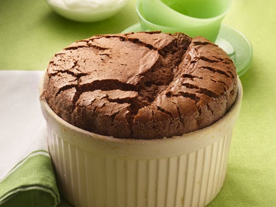

# Chocolate Soufflé

**Prep Time:** 10 minutes
**Cooking Time:** 10 minutes
**Serves:** 4

## Ingredients
### For the soufflé
- 85 grams dark chocolate (chopped)
- 4 free-range eggs (separated)
- 85 grams caster sugar
- butter (for greasing)

### For the sauce
- 100 ml water
- 40 grams caster sugar
- 55 grams dark chocolate
- 40 grams cocoa powder
- 1 tablespoon cream
- icing sugar (to dust)

## Method
1. Preheat the oven to 220°C.
1. Place a glass bowl over a pan of simmering water. Add the chopped chocolate and melt.
1. Once the chocolate has melted, stir in the egg yolks.
1. In a large clean bowl, whisk the egg whites to form soft peaks.
1. Add the sugar and whisk again to make stiff, glossy peaks.
1. Fold the egg whites into the chocolate mixture.
1. Grease two chefs' rings with butter and place on a baking sheet. Divide the soufflé mixture between the rings and then bake in the oven for 8-10 minutes, until well risen.
1. To make the sauce, heat the water, sugar, chocolate and cocoa powder in a pan, whisking constantly to make a glossy chocolate sauce.
1. Remove the soufflés from the oven, place onto serving plates and pour the sauce around. Drizzle with a little cream, and dust with icing sugar to serve.