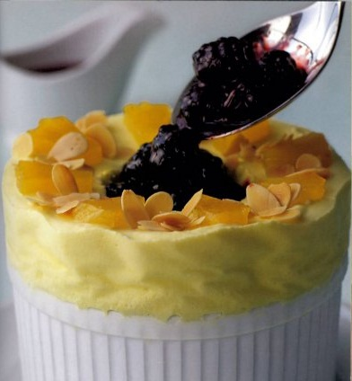

# Frozen pineapple soufflé with blackberries

*This impressive dessert is smooth, refreshing and utterly delicious. All the components can be prepared a day or two in advance , so on the day you just need to assemble it, which takes no time at all.*

**Serves:** 8 - 10

## Ingredients
- 1 ripe pineapple (about 1 kg)
- 12 cloves
- 750 ml sirop a sorbet
- 250 grams blackberries
- 1 teaspoon groundnut oil (to brush)
- 1 sheet leaf gelatine
- 150 grams meringue Italienne
- 150 ml whipping cream
- 30 ml kirsch
- 40 grams lightly toasted flaked almonds

## Method
### For the pineapple
1. Using a serrated knife, cut a 2 cm slice from the base of the pineapple and a 3 cm slice from the top, removing the leafy fronds.
1. Cut of all the skin and prise out any little black 'eyes# that remain.
1. Cut the peeled pineapple length-ways into 6 pieces and stud each one with 2 cloves.
1. Bring the sirop a sorbet to the boil in a large saucepan, then add the pineapple.
1. Lower the heat and poach at 80 - 90°C for 30 minutes.
1. Take the pan off the heat and leave the pineapple pieces to cool in the syrup.
1. Drain once cooled, reserving the syrup.
1. Discard the cloves and cut away the pineapple core.
1. From the most attractive pieces, cut 2 or 3 sliced, 5 mm thick, then cut these into smaller pieces, reserving for decoration.
1. Put the remaining pineapple into a blender and process for 2 minutes to a purée.
1. Pass through a chinois or fine-meshed conical sieve into a bowl, pressing down with the back of a small ladle to extract as much purée as possible.
1. Cover and refrigerate.

### For the blackberries
1. Put the blackberries and half of the reserved poaching syrup into a saucepan and bring to the boil over a medium heat.
1. Lower the heat and poach at 80 - 90°C for 5 minutes.
1. Remove from the heat and leave the berries to cool in the syrup.
1. Once cold, put half of the berries with half of their poaching syrup into a blender and process for 1 minutes, then strain through a chinois or fine-meshed conical sieve into a bowl.
1. Cover and refrigerate this coulis, and the remaining blackberries in their syrup.

### To prepare the soufflé dish
1. You will need a soufflé dish about 13 cm in diameter and 8 cm high.
1. Fold a large piece of greaseproof paper in three length-ways (it needs to be long enough to go rounds the outside of the dish and wide enough to extend 6 - 8 cm above the rim).
1. Wrap the paper around the dish and secure it with kitchen string.
1. Lightly brush the inside of the paper above the rim with oil.
1. Put the dish in the freezer.

### To make the soufflé
1. Soak the gelatine in a dish of cold water for 5 minutes. Put the pineapple purée into a large bowl and whisk in the meringue.
1. In another bowl, whip the cream to a ribbon consistency, then fold into the pineapple meringue mixture, using a rubber spatula.
1. Warm the kirsch slightly in a small pan, then take off the heat.
1. Drain the gelatine, squeezing out excess water and add to the kirsch, stirring to dissolve.
1. Fold into the soufflé mixture, without overworking.
1. Take the dish from the freezer and fill with the mixture, to 4 - 5 cm above the rim.
1. Freeze for 3 hours, or refrigerate for 8 hours.

### To serve
1. Take off the string and carefully remove the paper collar.
1. Scoop out 4 or 5 dessert spoonfuls from the middle of the soufflé, dipping the spoon in hot water before each scoop.
1. Coat the reserved poached blackberries with two spoonfuls of the reserved blackberry coulis and use to fill the cavity.
1. Arrange the reserved pineapple pieces around the top, alternating them with toasted flaked almonds.
1. Serve at once with the remaining blackberry coulis in a jug on the side.