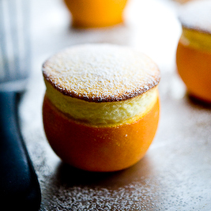

# Orange Soufflé

**Serves:** 4

## Ingredients
- 40 grams butter (softened)
- 70 grams caster sugar (split 50 grams / 20 grams)
- 40 grams caster sugar (to coat the dishes)
- 250 ml freshly squeezed orange juice
- 125 ml milk
- 3 egg yolks
- 6 egg whites
- 10 grams plain flour
- 10 grams cornflour
- very finely grated zest of 2 oranges
- 30 ml Grand Marnier
- 30 grams icing sugar (to dust)

### To serve
- 4 large oranges (shell only)

## Method
1. Brush 4 ramekins or small soufflé dishes, about 8 cm diameter and 6 cm high with the butter.
1. Put the 40 grams of caster sugar in one of the buttered dishes and rotate it at an angle so that the sugar coats the inside entirely, then tip the excess into the next dish, tapping as you do so.
1. Repeat until all the dishes are coated.
1. Simmer the orange juice in a pan over a medium heat, to reduce by half to 125 ml.
1. Slowly bring the milk to the boil over a gentle heat, then whisk in the reduced orange juice and continue whisking until it returns to the boil.
1. Whisk the egg yolks and 20 grams of the caster sugar together in a bowl for 1 minute, then add the flour and cornflour and whisk for a further minute.
1. Pour the  boiling milk and orange juice on to the whisked egg mixture, whisking all the time, then mix in the orange zest.
1. Reduce the heat to medium, and pour the mixture back in to the pan and stir with a whisk until the mixture comes to the boil.
1. Allow to boil very gently for 1 minute, stirring, then add the Grand Mariner.
1. Pour the orange flavoured crème patissière into a bowl,  cover with cling film and set aside for 10 minutes.
1. Preheat the oven to 190°C.
1. In a clean bowl, whisk the egg whites to soft peaks.
1. Gradually whisk in the remaining 50 grams of caster sugar.
1. Using a whisk, incorporate one-third of the whites into the soufflé mixture, without overworking.
1. Now gently fold in the remaining egg whites, using a rubber spatula, until the mixture is just smooth and homogeneous; take care not to overwork.
1. Using a large spoon, divide the soufflé mixture between the prepared dishes, and give each a light tap on the work surface.
1. Slide the blade of a small knife around the inside of each dish, to give the soufflés  a good shape as they rise in the oven.
1. Bake for 7 - 8 minutes.
1. On removing from the oven, sprinkle the tops with icing sugar.
1. Stand each dish on an individual plate lined with a napkin and serve at once.
1. Serve each soufflé in a hollowed out large orange.