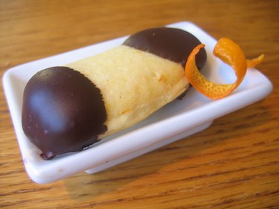

# Chocolate-dipped langues de chat

*A lovely, classic petit four to serve with coffee, these also go very well with many fruit desserts, as well as ice cream.*

**Yield:** 40

## Ingredients
- 125 grams butter (softened)
- 125 grams icing sugar
- 25 grams ground almonds
- 3 egg whites
- 165 grams plain flour
- 1 vanilla pod (split length-ways and seeds scraped out)
- 200 grams dark chocolate (70% cocoa solids)

## Method
1. Beat the butter and 100 g of the icing sugar together in a bowl with a wooden spoon for 1 minute. 
1. Sift the ground almonds and remaining 25 g icing sugar together over the mixture, then stir in. 
1. Incorporate the egg whites one at a time, then finally mix in the flour and vanilla seeds. 
1. Cover the bowl with cling film and set aside for at least 20 minutes to rest.
1. Preheat the oven to 190°C. Transfer the mixture to a piping bag fitted with a 1 cm plain nozzle. 
1. Pipe 6 - 7 neat lengths onto a non stick baking sheet (or regular sheet lightly buttered and dusted with flour), leaving about 2 cm between each one.
1. Bake for 5 - 6 minutes, until lightly coloured. 
1. Use a small palette knife to transfer the langues de chat to a wire rack and leave to cool.
1. Gently melt the chocolate in a heatproof bowl set over a pan of barely simmering water. 
1. One at a time, partially dip the langues to chat into the melted chocolate to half-coat them, then place flat side down on a tray lined with baking parchment and leave until the chocolate has set.
1. Store interleaved with greaseproof paper in an airtight container to cool, dry place until ready to serve.