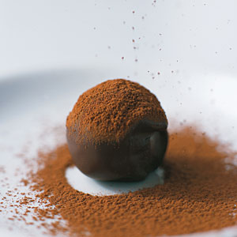

# Chocolate truffles

**Yield:** 80

*These dark rich truffles are especially nice either served with drinks before a dinner party or with coffee after the main meal.*

## Ingredients
- 750 grams dark chocolate (chopped)
- 150 ml double cream
- 225 grams butter (chopped, at room temperature)
- 325 ml Armagnac (or Grand Marnier)
- 500 grams dark cocoa powder

## Method
1. Put 450 grams of the chocolate into a heatproof bowl and set over a saucepan one-third filled with hot water, making sure that the bottom of the bowl does not touch the water in any way.
1. Place over a gentle heat (the water should not exceed 60°C).
1. As soon as the chocolate has melted, remove the bowl from the heat.
1. Bring the cream to boil in a small pan.
1. As soon as it boils, remove from the heat and set aside until it has cooled to about 40°C.
1. Add the cream to the chocolate, mixing it in with a balloon whisk until smooth.
1. Add the butter a little at a time, still whisking and without over-working.
1. Slowly pour in the Armagnac or Grand Mariner, stirring gently with the whisk until mixed.
1. Set aside to cool for about an hour, to allow the chocolate ganache to firm up a little.
1. Put the mixture into a piping bag fitted with a 1 - 1.5 cm plain nozzle and pipe small mounds, about 2 cm in diameter, onto trays lined with greaseproof paper and refrigerate for 2 hours.
1. Roll each mound in the palm of your hand for 3 - 5 seconds, to make little balls.
1. Chill until you are ready to dip and coat the truffles.

### To assemble
1. Put 300 grams of the chocolate into a heatproof bowl and set over a saucepan one-third filled with hot water, making sure that the bottom of the bowl does not touch the water in any way.
1. Place over a gentle heat (the water should not exceed 60°C).
1. As soon as the chocolate has melted, remove the bowl from the heat.
1. Spread the cocoa powder on a work surface or a tray.
1. Using a small fork or round dipping tool, dip the truffles, one at a time, into the melted chocolate for 1 - 2 seconds to coat, then immediately place in the cocoa powder and turn with a fork to roll and coat in the cocoa.
1. Transfer the coated truffles to a fine-meshed wire rack and set aside to cool.