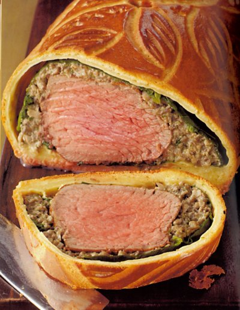

# Beef wellington

*The beef can be wrapped in its pastry crust up to 4 hours in advance and kept in the fridge, ready to bake when you are ready to eat.*

**Serves:** 6

## Ingredients
### Pastry
- 260 ml tepid milk
- 12 grams fresh yeast
- 450 grams plain flour
- 10 grams fine salt
- 3 egg yolks
- 90 grams butter (slightly softened)
- 45 grams caster sugar

### Filling
- 1 fillet of beef (about 800 grams)
- salt and freshly ground pepper
- 80 grams clarified butter
- 60 grams butter
- 500 grams button mushrooms (finely chopped)
- juice of 1 lemon
- 60 grams shallot (finely chopped)
- 100 ml double cream
- 12 large spinach leaves
- 4 herb crêpes
- eggwash (1 egg yolk mixed with 1 tablespoon milk)

### To serve       
- béarnaise sauce

## Method
### For the pastry
1. Put the milk and yeast into a bowl and stir to dissolve the yeast.
1. Put the flour, salt and eggs into an electric mixer fitter with a dough hook and pour in the milk and yeast mixture.
1. Mix on low speed to combine and knead the dough for 5 minutes.
1. Scrape down the sides of the bowl with a rubber spatula, then knead at medium speed for about 10 minutes.
1. By this stage, the dough should be smooth, elastic and well amalgamated.
1. Meanwhile, in another bowl, mix the butter and sugar together well.
1. Add a few small pieces to the dough, then with the mixer running at low speed, add the rest, a piece at a time.
1. When the butter mixture is incorporated, increase the speed and work for 6 - 10 minutes until the dough is very smooth and shiny, and comes away from the bowl with perfect elasticity.
1. Remove the dough hook, leaving the dough in the bowl.
1. Cover with a tea towel and leave to rise at approximately 24°C for 2 hours until the dough has doubled in volume.
1. Knock the dough back by flipping it over 2 or 3 times with your hand.
1. Cover the bowl again and refrigerate for several hours (but not more than 24 hours).

### For the beef fillet
1. Preheat the oven to 200°C.
1. Trim the fillet of any membrane, then season all over with salt and pepper.
1. Heat the clarified butter in a roasting pan over a medium - high heat and sear the beef for 3 - 4 minutes until golden turning to colour evenly.
1. Transfer to the oven and roast for 6 minutes, turning the meat over after 3 minutes.
1. Lift the beef onto a wire rack and leave to cool completely.
1. At this stage it will be very rare.

### For the mushroom duxelles.
1. Heat the 60 grams of butter in a pan over a medium heat.
1. Add the mushrooms and lemon juice and cook, stirring from time to time, until all the moisture has evaporated.
1. Add the shallot and cook for another 2 minutes, then pour in the cream and cook, stirring until it is all absorbed.
1. Season to taste and set aside to cool, then chill.

### For the spinach
1. Blanch the spinach leaves in boiling salted water for 3 seconds, then drain and refresh in cold water.
1. Drain well, separate the leaves and pat each one dry with kitchen paper.

### To assemble
1. Roll out the pastry on a lightly floured surface to a 40 x 25 cm rectangle, 3 - 4 mm thick.
1. Trim the side to neaten.
1. Place 2 crêpes along the middle of the rectangle and cover them with 8 spinach leaves.
1. Spoon and spread a 1 cm thick band of mushroom duxelles along the middle of the spinach and crêpes.
1. Put the cold beef fillet on top and thickly cover the whole surface, including the ends, with the remaining duxelles.
1. Cover the mushroom duxelles with the remaining spinach leaves and crêpes.
1. Fold the crêpes over the beef and if necessary, cut off any overlapping parts with scissors.
1. Lightly brush the 2 ends of the pastry rectangle with eggwash.
1. Fold one side over the beef, brush it and the ends with eggwash, then fold the other side over the beef.
1. Roll out the 2 ends of the pastry to a 5 - 6 mm thickness, and trim to an 8 cm length.
1. Brush these with eggwash and fold then over the beef.
1. Turn the pastry wrapped beef over onto a baking sheet and refrigerate for 30 minutes.
1. Heat the oven to 200°C.

### To bake
1. Brush the entire surface of the pastry with eggwash and score it with leaf patterns using a knife tip.
1. Cut a small aperture in the middle of the pastry to allow the steam to escape during cooking.
1. Bake for 25 minutes if you like the beef rare, or 35 minutes for medium.
1. If the pastry becomes too brown as it cooks, cover loosely with foil and lower the oven setting to 170°C.

### To serve
1. Use a palette knife to transfer the cooked beef to a wire rack and leave it to rest for 5 minutes.
1. Care the beef in its crust into thick slices and serve on warm plates, with a generous spoonful of béarnaise sauce.