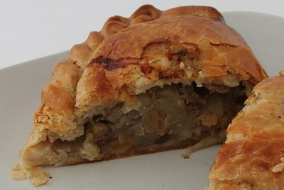

# Lamb pasties

*This variation on a Cornish pasty can either be used as a main meal, served with potatoes or a light snack.*

**Serves:** 8

## Ingredients
- 750 grams [Shortcrust pastry](../../baking/pastry/shortcrust-pastry.md) 
- 1 egg (beaten)

### For the filling
- 450 grams lean lamb (coarsely minced or chopped)
- 25 grams beef dripping or lamb fat
- 25 grams plain flour
- 1 garlic clove (crushed)
- half a teaspoon thyme (freshly chopped)
- half teaspoon sage (freshly chopped)
- 100 grams onions (small dice)
- 100 grams carrots (small dice)
- 100 grams celery (small dice)
- 100 grams swede (small dice)
- 100 grams parsnip (small dice)
- salt and freshly ground white pepper
- 25 grams plain flour
- 900 ml chicken stock (reduced to 300 ml)
- 150 ml veal jus
- 2 potatoes (boiled in their skins)
- Worcestershire sauce

## Method
### To make the filling
1. Fry the minced lamb in the dripping, colouring on all sides and separating the grains.
1. Add the garlic, herbs, diced onions, carrots and celery, cover and cook for about 10 minutes.
1. Season with salt and generously with the pepper.
1. Add the flour and continue to cook for a few minutes, so the raw taste of the flour is removed.
1. Add one-third of the reduced chicken stock and cook for 10 - 15 minutes.
1. Check for seasoning and add the remaining stock and the veal jus.
1. Peel the boiled potatoes and cut into 1 cm dice.
1. Add them to the meat and cook for 5 - 6 minutes.
1. Check for seasoning with salt and pepper again.
1. Add 2 - 3 drops of Worcestershire sauce.
1. Allow the mixture to cool.

### To make the pasties
1. Roll out the pastry and cut into eight squares (15 cm each).
1. When the filling mix is cold, spoon some on to each square of pastry slightly off centre.
1. Brush around the edges with the beaten egg and fold over diagonally to make a triangle.
1. Trim to a semi-circle, shape and then pinch with thumb and forefinger all the way round the edges to seal.
1. Brush over each of the pasties with the beaten egg and leave in the fridge for 20 minutes before baking.

### To bake
1. Preheat the oven to 200°C and dampen a baking sheet.
1. Sit the pasties on the baking sheet and place in the oven for 30 minutes, they should be crisp and golden brown.