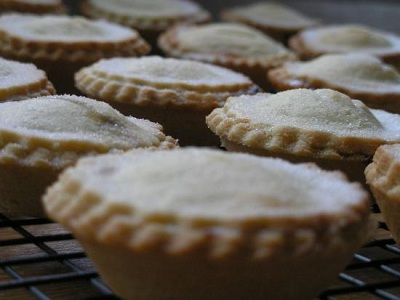

# Mini mince pies

*The mincemeat for these pies needs to macerate for at least 2 weeks before using, so make it well in advance. You'll have more than you need for one batch of pies; save the rest for the following year when it will taste even better.*

*Make the mince pies a few days before Christmas and store in a dry place.*

**Yield:** 48

## Ingredients
- 360 grams [shortbread pastry](../../baking/pastry/shortbread-dough.md) 
- eggwash (1 egg yolk mixed with 1 tablespoon of milk)
- 60 grams caster sugar

### mincemeat
- 225 grams sultanas
- 450 grams raisins
- 450 grams currant
- 450 grams beef fat or suet (finely minced)
- 1 large cooling apple (peeled, cored and grated)
- 100 grams glacé fruits
- 350 grams soft brown sugar
- 1 teaspoon freshly grated nutmeg
- 1 teaspoon freshly grated mace
- 1 teaspoon ground cloves
- 1 teaspoon ground cinnamon
- 50 ml Cognac
- grated zest and juice of 1 lemon

## Method
### Making the mincemeat
1. Rinse the dried fruit, dry thoroughly and roughly chop the sultanas and raisins.
1. Put the beef fat or suet in a very large bowl, then add the dried fruit and all the other ingredients in the order listed, mixing with a spatula until well combined.
1. Cover with ling film and leave to macerate in a cool larder or the vegetable drawer of the refrigerator for 24 hours.
1. Pack the mincemeat into sterilised preserving or kilner jars.
1. Make sure there are no air pockets by pushing the mixture hard into the bottom of the jars and filling them to the brim.
1. Cover each with a waxed paper disc and seal the jars with the clip.
1. Store the jars in a larder or the vegetable drawer of the refrigerator.

### Prepare the pastry
1. Roll out the pastry to a 2 mm thickness and use 6 cm and 4.5 cm pastry cutters to cut out 48 discs of each size.
1. Line 48 lightly greased 4.5 cm diameter (1 cm deep) tartlet tins with the large discs.
1. Prick the bases and fill them with mincemeat.
1. Lightly brush the borders of the smaller discs with cold water and place them on top of the filled mince pies.
1. Press the edges gently to ensure that the lids are sealed to the pastry cases.
1. Leave to rest in the refrigerator for 20 minutes.

### To bake the mince pies
1. Preheat the oven to 180°C.
1. Bush the pastry with eggwash and bake the pies for about 10 minutes until pale golden brown.
1. Sprinkle with caster sugar and return to the oven for 1 minute to glaze.
1. Immediately unmould the pies before they cool in the tin, and place on a wire rack.
1. Serve warm, with a glass of sherry or a cup of coffee.