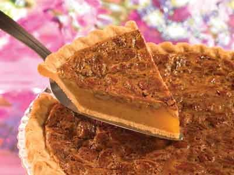

# Pecan pie

*This soft-textured American-style pie is best served warm with vanilla ice cream. If left until cold, the tart loses some of its flavour.*

**Serves:** 8

## Ingredients
- 240 grams [shortbread pastry](../../baking/pastry/shortbread-dough.md) 
- 230 grams butter (softened)
- 80 grams maple syrup
- 150 grams caster sugar
- 3 eggs
- 350 grams shelled pecan nuts
- 50 grams plain flour

## Method
### Prepare the pastry
1. Roll out the pastry to a round, 2 -  3 mm thick, and use to line a lightly greased 20 cm diameter (2.5 cm deep) flan ring.
1. Chill the pastry in the refrigerator for 20 minutes.

### Blind bake the pastry
1. Preheat the oven to 180°C.
1. Prick the pastry base with a fork.
1. Line the pastry case with greaseproof paper, and fill with a layer of baking beans.
1. Bake the pastry case blind in the oven for 20 minutes.
1. Remove the paper and the beans and return the pastry case to the oven for 5 minutes.
1. Set the pastry aside to cool.
1. Decrease the oven temperature to 170°C.

### Make the filling
1. Work the butter, maple syrup and sugar together in a bowl using a whisk until creamy.
1. Incorporate the eggs one at a time, working each one in with the whisk before adding the next.
1. Set aside about 100 grams of the best pecan halves; coarsely chop the rest.
1. Mix the chopped pecans and the flour into the filling, taking care not to over work the mixture.

### Baking the pie
1. Pour the filling into the cooked pastry case.
1. Arrange the pecan halves on top and bake in the oven for 20 - 25 minutes until the surface is golden brown and the top feels firm to the touch.
1. Lift off the flan ring and leave the pie to cool until warm before slicing and serving.