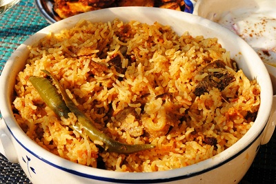

# Biryani

*This one-pot rice and meat preparation was traditionally cooked during royal festival days. It can be made with chicken, lamb, seafood or vegetables.*

**Serves:** 4

## Ingredients
- 500 grams boned leg of lamb (cut into bit-sized pieces)
- 4 tablespoons sunflower oil
- 1 onion (finely chopped)
- 1 tablespoon ground coriander
- 1 teaspoon ground cumin
- 1 teaspoon chilli powder
- 1 teaspoon ground tumeric
- 225 grams tinned tomatoes (chopped)

### Marinade
- 4 garlic cloves (crushed)
- 1 teaspoon ginger (finely grated)
- 50 ml natural yoghurt
- 6 tablespoons coriander leaves (freshly chopped)

### Rice
- 4 tablespoons sunflower oil
- 2 teaspoons cumin seeds
- 1 onion (thinly sliced)
- 6 cloves
- 10 black peppercorns
- 4 cardamom pods
- 1 cinnamon stick
- 225 grams basmati rice
- 1 teaspoon saffron threads
- 3 tablespoons warm milk

## Method
### To make the marinade
1. Combine the garlic, ginger, yoghurt and coriander in a glass bowl.
1. Add the lamb and rub the marinade into the lamb pieces.
1. Cover and marinate in the fridge for 4 - 6 hours.

### To cook the lamb
1. Heat the sunflower oil in a large heavy-based pan, add the onion and cook for 12 - 15 minutes, until lightly golden.
1. Add the marinated lamb and cook over a high heat for 15 minutes, stirring often.
1. Stir in the ground coriander, cumin, chilli powder, tumeric and tinned tomatoes.
1. Season well and bring to the boil.
1. Reduce the heat to low and simmer gently for 30 minutes, or until the lamb is tender and most of the liquid has been absorbed.
1. Set aside.

### To prepare the rice
1. Heat the sunflower oil in a heavy-based pan
1. Add the cumin seeds, onion, cloves, peppercorns, cardamom pods and cinnamon and stir-fry for 6 - 8 minutes.
1. Add the rice and stir-fry  for 2 minutes.
1. Pour in 400 ml of water and bring to the boil.
1. Cover and summer gently for 6 - 7 minutes.
1. Set aside.
1. Mix the saffron and milk and set aside.

### To cook
1. Preheat the oven to 180°C.
1. Put a thin layer of the meat mixture in a casserole dish and cover with half the rice.
1. Drizzle over half the saffron mixture.
1. Top with the remaining lamb mixture and cover with the remaining rice.
1. Drizzle over the remaining saffron mixture.
1. Cover the casserole dish with foil then cover with the lid.
1. Bake in the pre-heated oven for 30 minutes.
1. Remove from the oven and leave to rest, still covered, for 30 minutes before serving.
