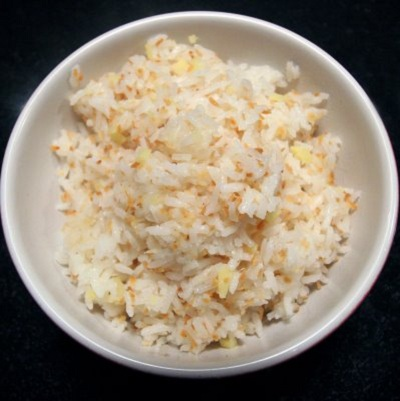

# Coconut rice

*This aromatic and mildly flavoured rice dish acts as a perfect foil to any spicy curry.*

**Serves:** 4

## Ingredients
- 225 grams basmati rice
- 2 tablespoons sunflower oil
- 2 teaspoons black mustard seeds
- 2 teaspoons cumin seeds
- 2 dried red chillies
- 10 fresh curry leaves
- 500 ml hot water
- 4 tablespoons coconut cream

## Method
1. Rinse the rice until the water runs clear.
1. Transfer to a bowl, cover with cold water and leave to soak for 15 minutes.
1. Drain thoroughly.
1. Heat the sunflower oil in a heavy-based saucepan and add the mustard seeds, cumin seeds, chillies and curry leaves.
1. Stir-fry for 30 seconds, then add the hot water and coconut cream.
1. Stir well and bring to the boil.
1. Reduce the heat to low, cover tightly and cook for 10 minutes.
1. Leave to stand undisturbed for 10 minutes.
1. Fluff up the rice with a fork and serve immediately.